# MySQL 数据库

---

## 1. MySQL 基础 和 SQL 入门

---

### 1.1 数据库基本概念

​    1、数据库( DataBase )就是 <u><b>存储</b></u> 和 <u><b>管理</b></u> 数据的仓库。

​    2、其本质是一个文件系统，还是以文件的方式将数据保存在电脑上。

​    3、数据存储方式:

<table style="margin: 0;padding: 0;border-collapse: collapse;width: 100%;">
        <thead style="margin: 0;padding: 0;">
            <tr style="margin: 0;padding: 0;">
                <th style="border: 1px solid #000;margin: 0;padding: 0;width: 20%;height: 90px;text-align: center;">
                    存储方式</th>
                <th style="border: 1px solid #000;margin: 0;padding: 0;width: 30%;height: 90px;text-align: center;">优&emsp;点
                </th>
                <th style="border: 1px solid #000;margin: 0;padding: 0;width: 30%;height: 90px;text-align: center;">缺&emsp;点
                </th>
            </tr>
        </thead>
        <tbody>
            <tr>
                <td
                    style="border: 1px solid #000;margin: 0;padding: 0;width: 20%;height: 90px;text-align: center;font-weight: bold;">
                    内存</td>
                <td style="border: 1px solid #000;margin: 0;padding: 0 10px;width: 30%;height: 90px">速度快</td>
                <td style="border: 1px solid #000;margin: 0;padding: 0 10px;width: 30%;height: 90px">
                    不能够永久保存，数据是临时状态</td>
            </tr>
            <tr>
                <td
                    style="border: 1px solid #000;margin: 0;padding: 0;width: 20%;height: 90px;text-align: center;font-weight: bold;">
                    文件</td>
                <td style="border: 1px solid #000;margin: 0;padding: 0 10px;width: 30%;height: 90px;">数据可以永久保存
                </td>
                <td style="border: 1px solid #000;margin: 0;padding: 0 10px;width: 30%;height: 90px;">使用 IO
                    流操作文件，不方便</td>
            </tr>
            <tr>
                <td
                    style="border: 1px solid #000;margin: 0;padding: 0;width: 20%;height: 90px;text-align: center;font-weight: bold;">
                    数据库</td>
                <td style="border: 1px solid #000;margin: 0;padding: 0 10px;width: 30%;height: 90px;">
                    <p style="margin: 0;padding: 0;width: 100%;">1、数据可以永久保存</p>
                    <p style="margin: 0;padding: 0;width: 100%;">2、方便存储和管理数据</p>
                    <p style="margin: 0;padding: 0;width: 100%;">3、使用统一的方式操作数据库</p>
                </td>
                <td style="border: 1px solid #000;margin: 0;padding: 0 10px;width: 30%;height: 90px;">
                    占用资源，有些数据库需要付费</td>
            </tr>
        </tbody>
        <tfoot>
            <tr style='border: 0;'>
                <td colspan="3" style="text-align: center;padding: 0;height: 45px;border: 0px;background: hsl(0deg, 100%, 100%);">
                    ※ 通过上面的比较，我们可以看出：使用数据库存储数据，用户可以非常方便对数据库中的数据进行增加、删除、修改以及查询等操作。
                </td>
            </tr>
        </tfoot>
    </table>


---

### 1.2 My SQL 安装

​    1、下载安装 My SQL 5.7.28 ，安装方式如下:

​        1、打开 mysql-5.7.28.msi 文件

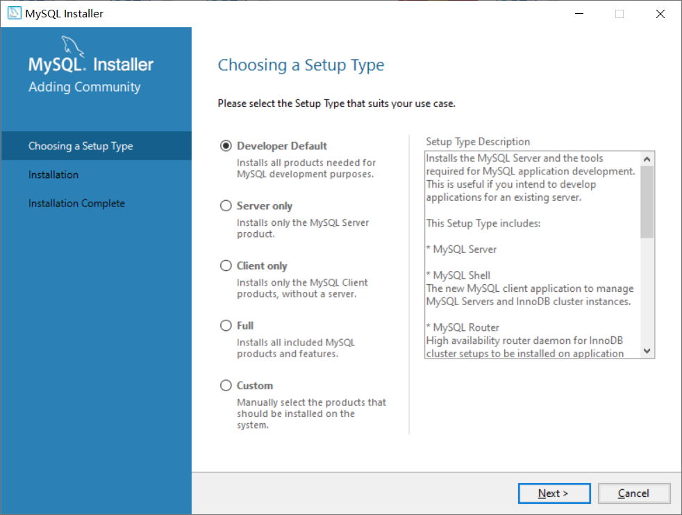

``` makefile
	1、Develper Default: 默认选项，默认安装 My SQL 服务器 和 默认的一些程序。
	2、Server only: 只会安装 My SQL 服务器。
	3、Client only: 只会安装一个客户端。
	4、Full: 安装 My SQL 所有的组件。
	5、Custom: 自定义安装。
	
```

​        2、因课程内容选择 Server only ( 第 2 个 )，点击 Next。

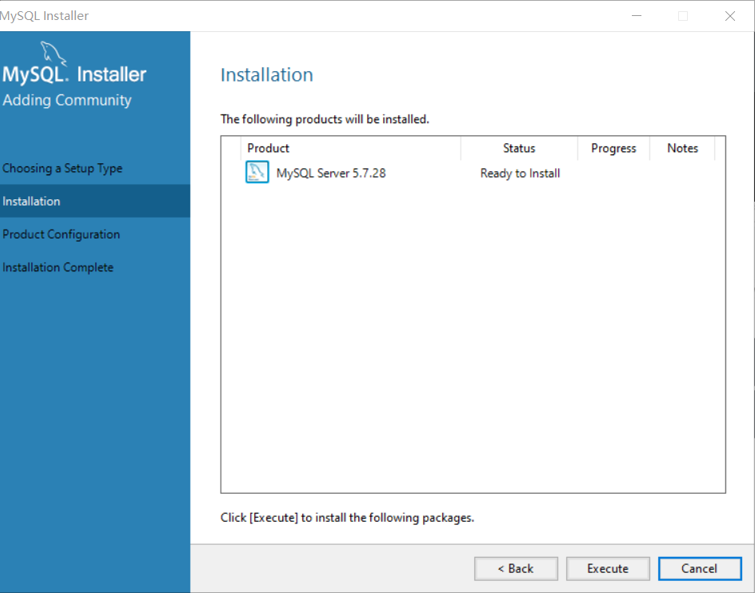

​        3、点击 Execute，进行安装。完成后:

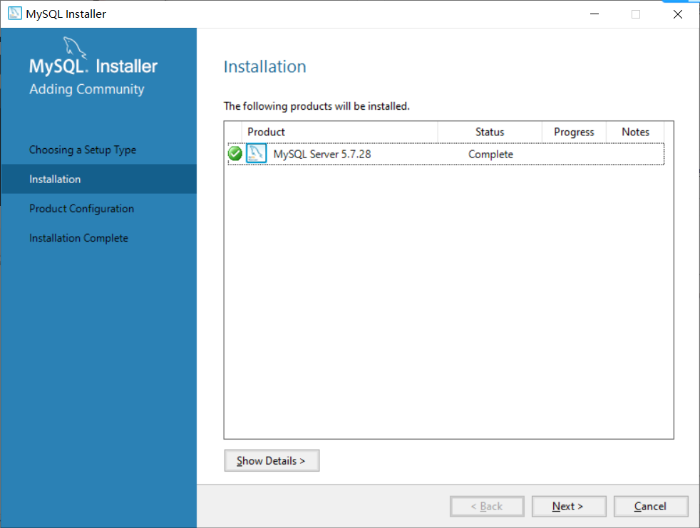

​        4、点击 Next 下一步。跳转到以下图片继续点击 Next 按钮。

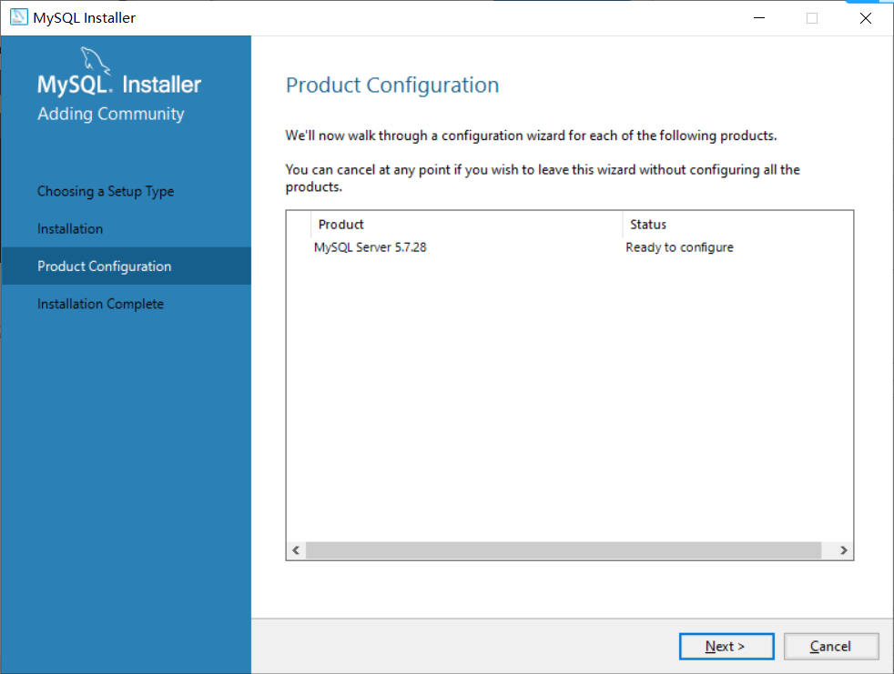

​        5、开始配置 My SQL: 选择第一个 单机使用 ，然后点击 Next 进行下一步配置。( 第二个是 联网使用，课程中暂时不需要。 )

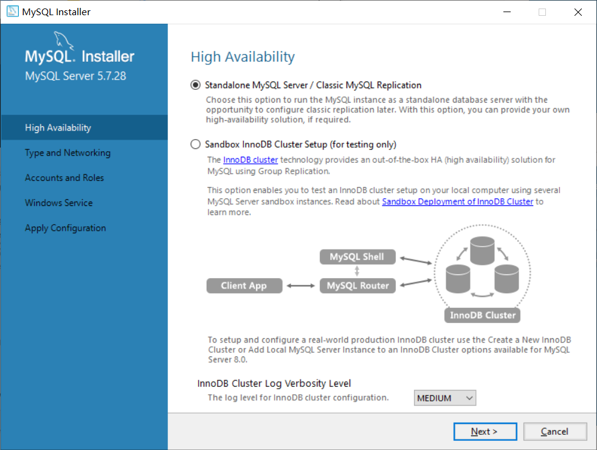

​        6、以下配置不需要做任何改动，配置: 

​            1、Port: 3306 此项是端口号；

​            2、Open Windows Firewall port for network access 此项是同意将以上端口号加入防火墙。

​        所以直接点击 Next 进行下一步即可。


​        7、开始配置用户及密码，然后直接点击 Next。( 当然也可以添加其他用户，点击 Add User )

​            1、My SQL User: root ( 默认 )

​            2、My SQL PassWord: 123456

​            3、My SQL Repeat PassWord: 123456

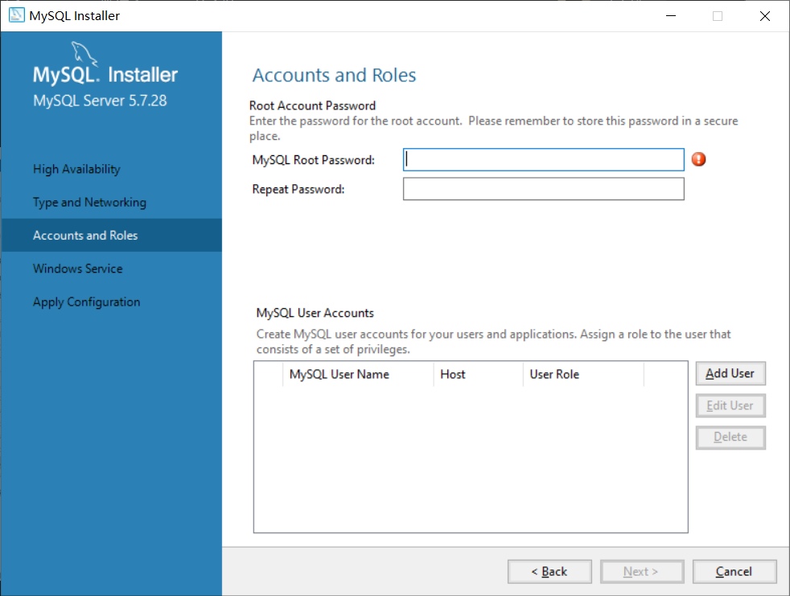

​        8、开始系统设置:

​            1、Configure MySQL Server as a Windows Service 将 My SQL 添加到 window 中。

​            2、Windiws Service Name: MYSQL57 此项为服务名称

​            3、Start the MySQL Server at System Startup 此项为：每次打开默认启动 root 用户。

​        此页面无需过多的配置，可以直接点击 Next，进行下一步。

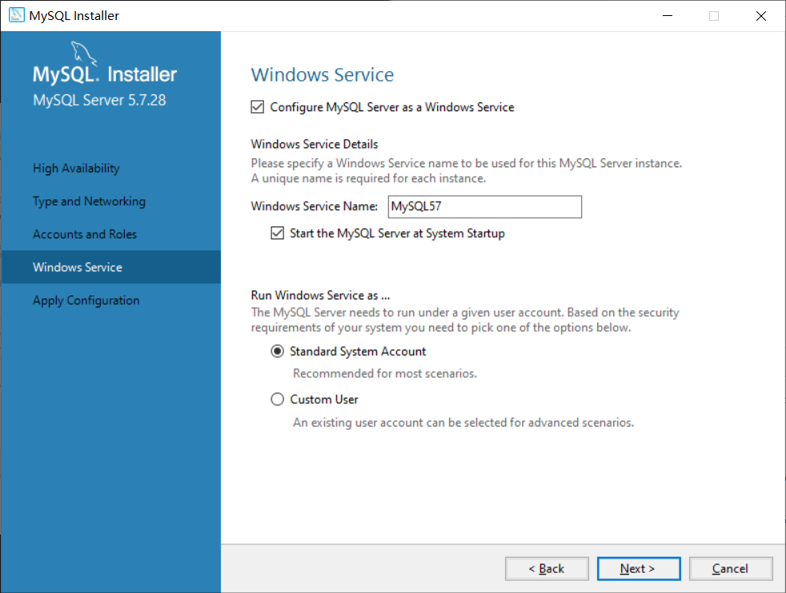

​        9、开始对以上选择进行配置，点击 Execute 按钮开始配置。

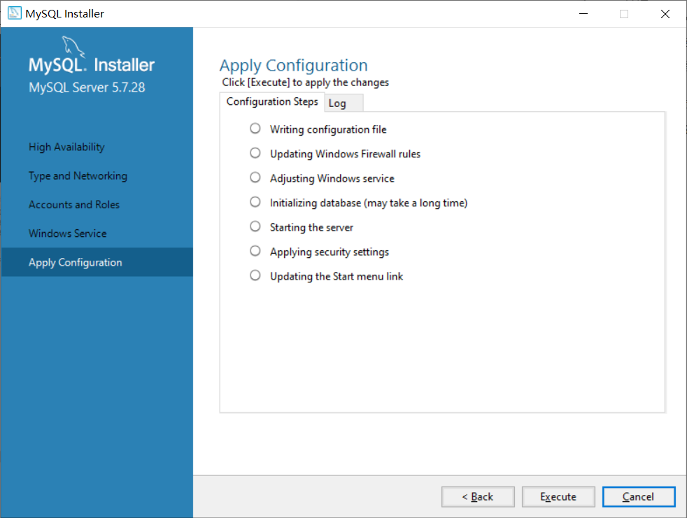

​        10、完成最终配置后，点击 Finish 完成。

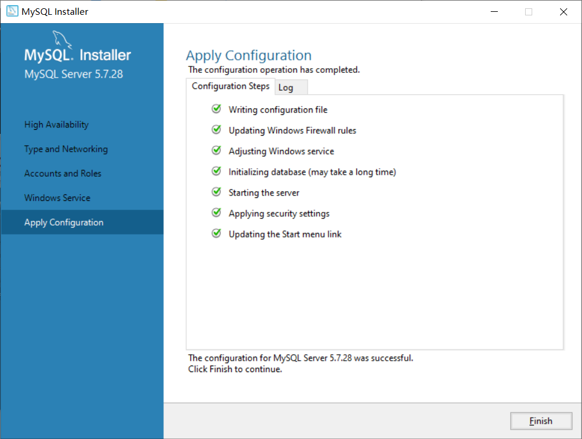

---

### 1.3 My SQL 卸载

​    1、目标：C:\ProgramData\MySQL，先使用 Windws 自带的卸载方式进行卸载，然后清除以上存储文件。

---

### 1.4 My SQL 环境配置方法

​    1、再次电脑中右击后，点击 属性( R )


​    2、在 <b><u>高级</u></b> 选项中点击 <u><b>全局变量</b></u> 中新建:  

​        变量名: MYSQL_HEMO

​        变量值: C:\ ** \MySQL Server 5.7 ( 此处的 ** 代表省略中间地址，需要找到真实目录将内容补全 )

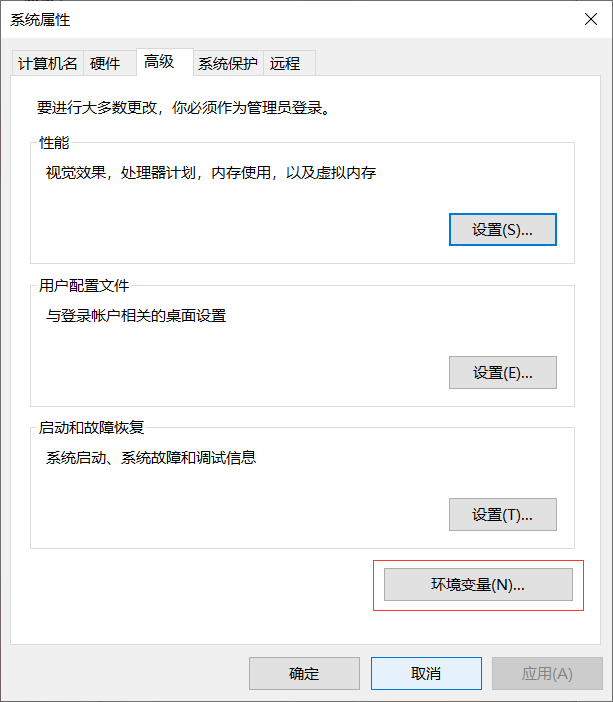

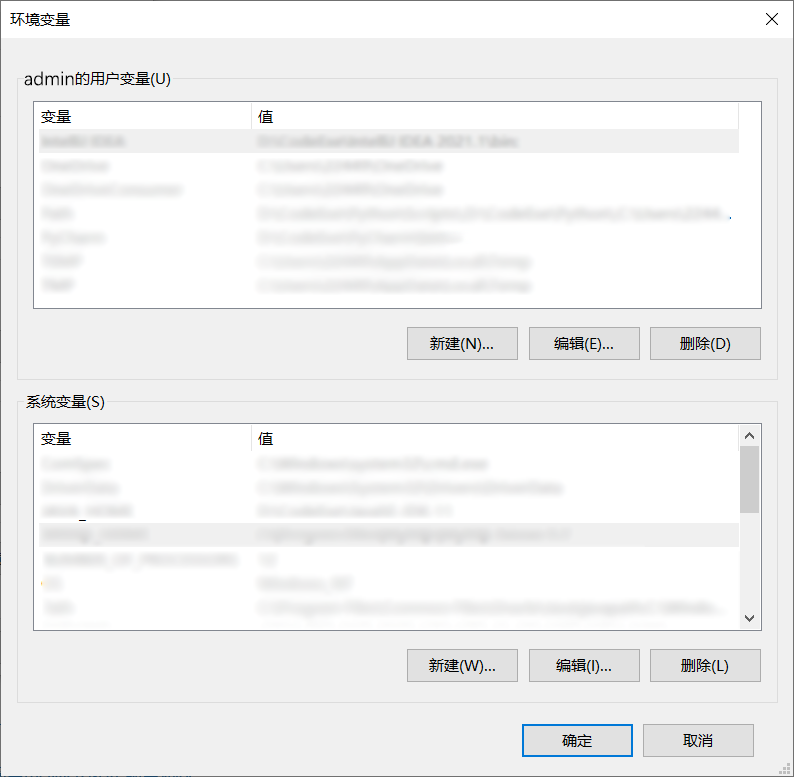

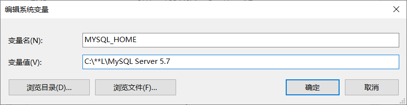

​    4、经过以上步骤应该已经配置成功，此时需要使用 window + r 调出 <u><b>运行</b></u> ，然后输入 'cmd' 打开命令提示符，输入 'mysql -u用户名 -p密码' ( 请自行带入，经过上方安装设置的话此处需要输入: mysql -uroot -p123456 )

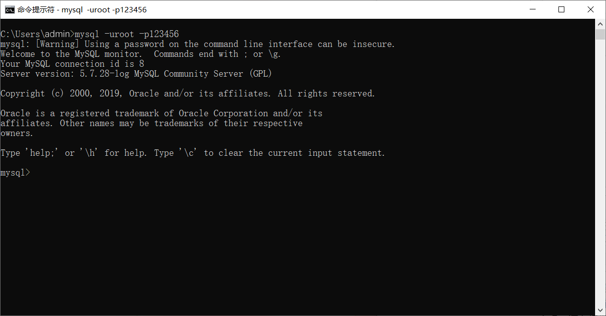

---

### 1.5 My SQL 启动 与 关闭

​    1、关闭服务需要使用命令提示符: net stop mysql57

​        会提示:

​            MySQL57 服务正在停止.

​            MySQL57 服务已被成功停止.

​    2、启动服务需要使用命令提示符: net start mysql57

​        会提示:

​            MySQL57 服务正在启动.

​            MySQL57 服务已经启动成功.

---

### 1.6 命令行登录 My SQL

​    1、使用命令提示符: mysql -uroot -p ( 隐式登录 )

​    2、使用命令提示符: mysql -uroot -p1* * * * 6 ( 明登录 )

---

### 1.7 SQLyog 安装

​    1、点击 SQLyog_setup.exe 安装文件，选择软件安装目录，点击安装即可。

​    2、配置链接:

​        1、点击 新建 创建一个新的用户，会弹出一个链接名称，可以正常命名，最后点击确定。

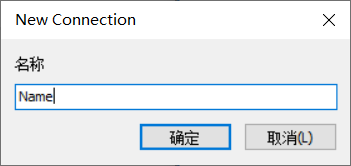

​    2、在 My SQL 项中设置:

​            用户名: root ( 经过上方1.2 ~ .14 配置的默认用户 )

​            密    码: 123456 ( 同理 1.2 ~ 1.4 )，并勾选 <u>保存密码</u> 选项

​        最后点击 <u>连接</u> 即可。

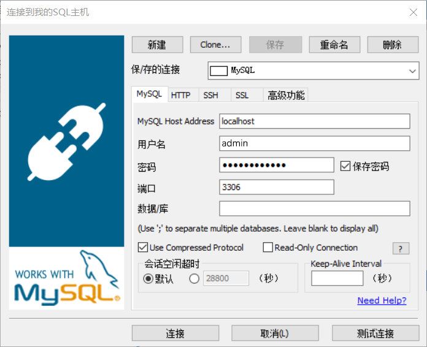

---

### 1.8 My SQL 目录结构

​    1、My SQL 默认安装目录在: C:\Program Files\MYSQL\MYSQL Server 5.7 目录下

​    2、My SQL 默认存储目录在: C\ProgramData\MYSQL\MYSQL Server 5.7 目录下

<table style="margin: 0;padding: 0;border-collapse: collapse;width: 100%;">
        <thead style="margin: 0;padding: 0;">
            <tr style="margin: 0;padding: 0;">
                <th style="border: 1px solid #000;margin: 0;padding: 0;width: 20%;height: 30px;text-align: center;">
                    目录文件</th>
                <th style="border: 1px solid #000;margin: 0;padding: 0;width: 80%;height: 30px;text-align: center;">
                    详&emsp;细
                </th>
            </tr>
        </thead>
        <tbody>
            <tr>
                <td colspan="2"
                    style="border: 1px solid #000;margin: 0;padding: 0;width: 20%;height: 30px;text-align: center;font-weight: bold;">
                    C:\Program Files\MYSQL\MYSQL Server 5.7
                </td>
            </tr>
            <tr>
                <td
                    style="border: 1px solid #000;margin: 0;padding: 0;width: 20%;height: 30px;text-align: center;font-weight: bold;">
                    bin
                </td>
                <td style="border: 1px solid #000;margin: 0;padding: 0 10px;width: 80%;height: 30px">放置一些可执行文件</td>
            </tr>
            <tr>
                <td
                    style="border: 1px solid #000;margin: 0;padding: 0;width: 20%;height: 30px;text-align: center;font-weight: bold;">
                    docs
                </td>
                <td style="border: 1px solid #000;margin: 0;padding: 0 10px;width: 80%;height: 30px;">
                    文档
                </td>
            </tr>
            <tr>
                <td
                    style="border: 1px solid #000;margin: 0;padding: 0;width: 20%;height: 30px;text-align: center;font-weight: bold;">
                    include
                </td>
                <td style="border: 1px solid #000;margin: 0;padding: 0 10px;width: 80%;height: 30px;">
                    包含( 头 )文件
                </td>
            </tr>
            <tr>
                <td
                    style="border: 1px solid #000;margin: 0;padding: 0;width: 20%;height: 30px;text-align: center;font-weight: bold;">
                    lib
                </td>
                <td style="border: 1px solid #000;margin: 0;padding: 0 10px;width: 80%;height: 30px;">
                    依赖库
                </td>
            </tr>
            <tr>
                <td
                    style="border: 1px solid #000;margin: 0;padding: 0;width: 20%;height: 30px;text-align: center;font-weight: bold;">
                    share
                </td>
                <td style="border: 1px solid #000;margin: 0;padding: 0 10px;width: 80%;height: 30px;">
                    用于存放字符集、语言等信息。
                </td>
            </tr>
            <tr>
                <td colspan="2"
                    style="border: 1px solid #000;margin: 0;padding: 0;width: 20%;height: 30px;text-align: center;font-weight: bold;">
                    C:\ProgramData\MYSQL\MYSQL Server 5.7
                </td>
            </tr>
            <tr>
                <td
                    style="border: 1px solid #000;margin: 0;padding: 0;width: 20%;height: 30px;text-align: center;font-weight: bold;">
                    Data
                </td>
                <td style="border: 1px solid #000;margin: 0;padding: 0 10px;width: 80%;height: 30px;">
                    保存数据库文件：数据库和数据表的信息
                </td>
            </tr>
            <tr>
                <td
                    style="border: 1px solid #000;margin: 0;padding: 0;width: 20%;height: 30px;text-align: center;font-weight: bold;">
                    Uploads
                </td>
                <td style="border: 1px solid #000;margin: 0;padding: 0 10px;width: 80%;height: 30px;">
                    保存上传的文件
                </td>
            </tr>
            <tr>
                <td
                    style="border: 1px solid #000;margin: 0;padding: 0;width: 20%;height: 30px;text-align: center;font-weight: bold;">
                    installer_config.xml
                </td>
                <td style="border: 1px solid #000;margin: 0;padding: 0 10px;width: 80%;height: 30px;">
                    安装配置文件
                </td>
            </tr>
            <tr>
                <td
                    style="border: 1px solid #000;margin: 0;padding: 0;width: 20%;height: 30px;text-align: center;font-weight: bold;">
                    my.ini
                </td>
                <td style="border: 1px solid #000;margin: 0;padding: 0 10px;width: 80%;height: 30px;">
                    保存 My SQL 数据库的配置信息
                </td>
            </tr>
        </tbody>
    </table>

---

### 1.9 My SQL 数据库管理系统

​    1、数据库管理系统 ( 又称: DataBase Management System, DBMS )，指的是一种操作和管理维护数据库的大型软件。My SQL 就是一个数据库管理软件，安装了 My SQL 的电脑，又被称之为: <u>数据库服务器</u> 。

​    2、数据库管理系统是用于： <u>建立</u>、 <u>使用</u> 以及 <u>维护</u> 数据库的，对数据库进行统一的管理。

​    3、数据库管理系统、数据库和数据库中的表之间的关系是：My SQL 中管理着很多的数据库，在实际开发环境中一个数据库一般对应了一个应用，数据库中保存着多张表，每张表对应着不同的业务，而表中保存着对应业务的数据。

---

### 1.10 SQL 通用语法

​    1、SQL 语句可以 <u>单行</u> 或 <u>多行</u> 书写，最后以分号( 英文输入法下的 ; )结尾。

​    2、可以使用 <u>空格</u> 和 <u>缩进</u> 来增加语句的可读性。

​    3、MySQL 中使用 SQL 不区分大小写，一般关键字大写, <u>数据库名</u>、<u>表名</u>、<u>列名</u> 小写。

​    4、注释方法

``` sql
	/* 方法一 */
	SHOW DATABASES; -- 查询数据库列表
	
	/* 方法二 */
	 SHOW DATABASES; /* 查询数据库列表 */
	 
	 /* 方法三 */
	 SHOW DATABASES; # 查询数据库列表
```

---

### 1.11 SQL 的分类

<table style="margin: 0;padding: 0;border-collapse: collapse;width: 100%;">
        <thead style="margin: 0;padding: 0;">
            <tr style="margin: 0;padding: 0;">
                <th style="border: 1px solid #000;margin: 0;padding: 0;width: 20%;height: 30px;text-align: center;">
                    分&emsp;类</th>
                <th style="border: 1px solid #000;margin: 0;padding: 0;width: 80%;height: 30px;text-align: center;">
                    详&emsp;细
                </th>
            </tr>
        </thead>
        <tbody>
            <tr>
                <td
                    style="border: 1px solid #000;margin: 0;padding: 0;width: 20%;height: 30px;text-align: center;font-weight: bold;">
                    数据定义语言
                </td>
                <td style="border: 1px solid #000;margin: 0;padding: 0 10px;width: 80%;height: 30px">
                    简称: DDL ( Data Definition Language ) 用来定义数据库对象: 数据库、表、列等
                </td>
            </tr>
            <tr>
                <td
                    style="border: 1px solid #000;margin: 0;padding: 0;width: 20%;height: 30px;text-align: center;font-weight: bold;">
                    数据操作语言
                </td>
                <td style="border: 1px solid #000;margin: 0;padding: 0 10px;width: 80%;height: 30px;">
                    简称: DML ( Data Manipulation Language ) 用来对数据库中表的记录进行更新
                </td>
            </tr>
            <tr>
                <td
                    style="border: 1px solid #000;margin: 0;padding: 0;width: 20%;height: 30px;text-align: center;font-weight: bold;">
                    数据查询语言
                </td>
                <td style="border: 1px solid #000;margin: 0;padding: 0 10px;width: 80%;height: 30px;">
                    简称: DQL ( Data Query Language ) 用来对数据库中表的记录进行查询
                </td>
            </tr>
            <tr>
                <td
                    style="border: 1px solid #000;margin: 0;padding: 0;width: 20%;height: 30px;text-align: center;font-weight: bold;">
                    数据控制语言
                </td>
                <td style="border: 1px solid #000;margin: 0;padding: 0 10px;width: 80%;height: 30px;">
                    简称: DCL ( Data Control Language ) 用来定义数据库的访问权限和安全级别，以及创建用户。( 了解 )
                </td>
            </tr>
        </tbody>
    </table>

---

### 1.12 创建数据库

​    1、创建一个新的数据库

```sql
    # 创建数据库
    CREATE DATABASE 需要创建的数据库的库名;
```

​        ※ 注: 创建时默认使用 Latin1 数据编码，属于西欧的编码，使用中文等容易出现乱码，以上第 1 种方式不建议使用。

​    2、创建时指定数据库的字符集

``` sql
    // 指定字符集创建数据库
    CREATE DATABASE 需要创建的数据库的库名 CHARACTER SET 字符集名;
```

---

### 1.13 查看数据库

   1、切换数据库的语句

```sql
	USE 想要切换到指定的那个数据库的库名;
```

​    2、查询当前正在使用库的名称: SELECT DATABASE();

``` sql
    SELECT DATABASE();
```

​    3、查询所有的数据库名称: SHOW DATABASES;

```sql
SHOW DATABASES;
```

---

### 1.14 修改数据库

​    1、修改数据库字符集:

``` sql
    ALTER DATABASE Nmae CHARACTER SET Type;
```

​    ※ 注: [Name, Type] = [请代入已创建且要修改字符集的数据库名, 请代入所需要更改的字符集]

​    2、查询当前数据库的基本信息:

```sql
    SHOW CREATE DATABASE 库名;
```

<p style='color: red;'>&emsp;&emsp;※ 注: 库名处请代入已创建的数据库名</p>

---

### 1.15 删除数据库

​    1、使用以下方法可以对数据库进行删除操作:

​        ※  温馨提示: 即便 不顺心也不要删库跑路哦! 

``` sql
    DROP DATABASE 需要删除的库名;
```

---

### 1.16 My SQL 自带数据库的介绍

<table style="margin: 0;padding: 0;border-collapse: collapse;width: 100%;">
        <thead style="margin: 0;padding: 0;">
            <tr style="margin: 0;padding: 0;">
                <th style="border: 1px solid #000;margin: 0;padding: 0;width: 20%;height: 30px;text-align: center;">
                    分&emsp;类</th>
                <th style="border: 1px solid #000;margin: 0;padding: 0;width: 80%;height: 30px;text-align: center;">
                    详&emsp;细
                </th>
            </tr>
        </thead>
        <tbody>
            <tr>
                <td
                    style="border: 1px solid #000;margin: 0;padding: 0;width: 20%;height: 30px;text-align: center;font-weight: bold;">
                    information_schema</td>
                </td>
                <td style="border: 1px solid #000;margin: 0;padding: 0 10px;width: 80%;height: 30px">
                    信息数据库，用于保存数据库的元数据，包括表、字段、索引、约束等，其他数据库的信息。
                </td>
            </tr>
            <tr>
                <td
                    style="border: 1px solid #000;margin: 0;padding: 0;width: 20%;height: 30px;text-align: center;font-weight: bold;">
                    mysql
                </td>
                <td style="border: 1px solid #000;margin: 0;padding: 0 10px;width: 80%;height: 30px;">
                    MySQL 核心数据库，用于保存的是 用户 和 权限
                </td>
            </tr>
            <tr>
                <td
                    style="border: 1px solid #000;margin: 0;padding: 0;width: 20%;height: 30px;text-align: center;font-weight: bold;">
                    performance_schema
                </td>
                <td style="border: 1px solid #000;margin: 0;padding: 0 10px;width: 80%;height: 30px;">
                    用于保存性能相关的数据，监控 MySQL 的性能
                </td>
            </tr>
            <tr>
                <td
                    style="border: 1px solid #000;margin: 0;padding: 0;width: 20%;height: 30px;text-align: center;font-weight: bold;">
                    sys
                </td>
                <td style="border: 1px solid #000;margin: 0;padding: 0 10px;width: 80%;height: 30px;">
                    用于记录 DBA ( Database Administrator, 数据库管理员 ) 的所有信息，更方便的让 DBA 快速了解数据库的运行情况
                </td>
            </tr>
        </tbody>
    </table>

​    ※ 注: 系统文件不建议更改！

---

### 1.17 常见的数据库类型

​    1、基本类型:

​        1)、int    整数类型

​        2)、double    浮点数类型

​        3)、varchar    字符串类型

​        4)、date    日期类型，只显示年月日，YYYY - MM - DD

​        5)、datetime    日期类型，年月日时分秒，YYYY-MM-DD HH:MM:SS

​       6)、char    字符串类型 ( 在 SQL 中 ) 

​    2、常用的数据类型:

<table style="margin: 0;padding: 0;border-collapse: collapse;width: 100%;">
        <thead style="margin: 0;padding: 0;">
            <tr style="margin: 0;padding: 0;">
                <th style="border: 1px solid #000;margin: 0;padding: 0;width: 20%;height: 30px;text-align: center;">
                    类&emsp;型</th>
                <th style="border: 1px solid #000;margin: 0;padding: 0;width: 80%;height: 30px;text-align: center;">
                    详&emsp;细
                </th>
            </tr>
        </thead>
        <tbody>
            <tr>
                <td
                    style="border: 1px solid #000;margin: 0;padding: 0;width: 20%;height: 30px;text-align: center;font-weight: bold;">
                    int</td>
                </td>
                <td style="border: 1px solid #000;margin: 0;padding: 0 10px;width: 80%;height: 30px">
                    整数类型，可以是正整数、负整数或零。
                </td>
            </tr>
            <tr>
                <td
                    style="border: 1px solid #000;margin: 0;padding: 0;width: 20%;height: 30px;text-align: center;font-weight: bold;">
                    double
                </td>
                <td style="border: 1px solid #000;margin: 0;padding: 0 10px;width: 80%;height: 30px;">
                    浮点数类型，可以是正数、负数或零。
                </td>
            </tr>
            <tr>
                <td
                    style="border: 1px solid #000;margin: 0;padding: 0;width: 20%;height: 30px;text-align: center;font-weight: bold;">
                    varchar
                </td>
                <td style="border: 1px solid #000;margin: 0;padding: 0 10px;width: 80%;height: 30px;">
                    字符串类型，可以是任意字符串。
                </td>
            </tr>
            <tr>
                <td
                    style="border: 1px solid #000;margin: 0;padding: 0;width: 20%;height: 30px;text-align: center;font-weight: bold;">
                    date
                </td>
                <td style="border: 1px solid #000;margin: 0;padding: 0 10px;width: 80%;height: 30px;">
                    日期类型，可以是任意日期，YYYY-MM-DD,且只有年月日,不包含时间(时分秒)。
                </td>
            </tr>
        </tbody>
    </table>

​    3、类型明细:

<table style="margin: 0;padding: 0;border-collapse: collapse;width: 100%;">
        <thead style="margin: 0;padding: 0;">
            <!-- todo: 头部声明 -->
            <tr style="margin: 0;padding: 0;background-color: #909399;"><th style="border: 1px solid #000;margin: 0;padding: 0;width: 10%;height: 30px;text-align: center;">字段类型</th><th style="border: 1px solid #000;margin: 0;padding: 0;width: 30%;height: 30px;text-align: center;">中文说明</th><th style="border: 1px solid #000;margin: 0;padding: 0;width: 30%;height: 30px;text-align: center;">字符说明</th><th style="border: 1px solid #000;margin: 0;padding: 0;width: 30%;height: 30px;text-align: center;">Java 类型</th></tr>
        </thead>
        <tbody>
            <!-- ****** todo: 字符串类型 ****** -->
            <tr style="margin: 0;padding: 0;"><td colspan="4" style="font-weight: bold;background-color: #67C23A;border: 1px solid #000;margin: 0;padding: 0;height: 30px;text-align: center;">字&emsp;符&emsp;串&emsp;类&emsp;型</td></tr>
            <tr style="margin: 0;padding: 0;background-color: #b3e19d;"><td style="border: 1px solid #000;margin: 0;padding: 0;width: 10%;height: 30px;text-align: center;">char(n)</td><td style="border: 1px solid #000;margin: 0;padding: 0;width: 30%;height: 30px;text-align: center;">固定长度</td><td style="border: 1px solid #000;margin: 0;padding: 0;width: 30%;height: 30px;text-align: center;">最大 255 个字符</td><td style="border: 1px solid #000;margin: 0;padding: 0;width: 30%;height: 30px;text-align: center;">java.lang.String</td></tr>
            <tr style="margin: 0;padding: 0;background-color: #b3e19d;"><td style="border: 1px solid #000;margin: 0;padding: 0;width: 10%;height: 30px;text-align: center;">varchar(n)</td><td style="border: 1px solid #000;margin: 0;padding: 0;width: 30%;height: 30px;text-align: center;">可变长度</td> <td style="border: 1px solid #000;margin: 0;padding: 0;width: 30%;height: 30px;text-align: center;">最大 65535 个字符</td><td style="border: 1px solid #000;margin: 0;padding: 0;width: 30%;height: 30px;text-align: center;">java.lang.String</td></tr>
            <tr style="margin: 0;padding: 0;background-color: #b3e19d;"><td style="border: 1px solid #000;margin: 0;padding: 0;width: 10%;height: 30px;text-align: center;">tinytext</td><td style="border: 1px solid #000;margin: 0;padding: 0;width: 30%;height: 30px;text-align: center;">可变长度</td><td style="border: 1px solid #000;margin: 0;padding: 0;width: 30%;height: 30px;text-align: center;">最大 255 个字符</td><td style="border: 1px solid #000;margin: 0;padding: 0;width: 30%;height: 30px;text-align: center;">java.lang.String</td></tr>
            <tr style="margin: 0;padding: 0;background-color: #b3e19d;"><td style="border: 1px solid #000;margin: 0;padding: 0;width: 10%;height: 30px;text-align: center;">text</td><td style="border: 1px solid #000;margin: 0;padding: 0;width: 30%;height: 30px;text-align: center;">可变长度 </td><td style="border: 1px solid #000;margin: 0;padding: 0;width: 30%;height: 30px;text-align: center;">最大 65535 个字符</td><td style="border: 1px solid #000;margin: 0;padding: 0;width: 30%;height: 30px;text-align: center;">java.lang.String</td></tr>
            <tr style="margin: 0;padding: 0;background-color: #b3e19d;"><td style="border: 1px solid #000;margin: 0;padding: 0;width: 10%;height: 30px;text-align: center;"> mediumtext</td><td style="border: 1px solid #000;margin: 0;padding: 0;width: 30%;height: 30px;text-align: center;">可变长度</td><td style="border: 1px solid #000;margin: 0;padding: 0;width: 30%;height: 30px;text-align: center;">最大 (2 ** 24) - 1 个字符 </td><td style="border: 1px solid #000;margin: 0;padding: 0;width: 30%;height: 30px;text-align: center;">java.lang.String </td></tr>
            <tr style="margin: 0;padding: 0;background-color: #b3e19d;"><td style="border: 1px solid #000;margin: 0;padding: 0;width: 10%;height: 30px;text-align: center;">longtext</td><td style="border: 1px solid #000;margin: 0;padding: 0;width: 30%;height: 30px;text-align: center;">可变长度</td><td style="border: 1px solid #000;margin: 0;padding: 0;width: 30%;height: 30px;text-align: center;">最大 (2 ** 32) - 1 个字符</td><td style="border: 1px solid #000;margin: 0;padding: 0;width: 30%;height: 30px;text-align: center;">java.lang.String</td></tr>
            <!-- ****** todo: 日期类型 ****** -->
            <tr style="margin: 0;padding: 0;"><td colspan="4" style="font-weight: bold;background-color:#E6A23C;border: 1px solid #000;margin: 0;padding: 0;height: 30px;text-align: center;">日&emsp;期&emsp;类&emsp;型</td></tr>
            <tr style="margin: 0;padding: 0;background-color: #f3d19e;"><td style="border: 1px solid #000;margin: 0;padding: 0;width: 10%;height: 30px;text-align: center;">date</td><td style="border: 1px solid #000;margin: 0;padding: 0;width: 30%;height: 30px;text-align: center;">3Byte( 字节 ), 年月日</td><td style="border: 1px solid #000;margin: 0;padding: 0;width: 30%;height: 30px;text-align: center;">YYYY-MM-DD</td><td style="border: 1px solid #000;margin: 0;padding: 0;width: 30%;height: 30px;text-align: center;">Date</td></tr>
            <tr style="margin: 0;padding: 0;background-color: #f3d19e;"><td style="border: 1px solid #000;margin: 0;padding: 0;width: 10%;height: 30px;text-align: center;">time</td><td style="border: 1px solid #000;margin: 0;padding: 0;width: 30%;height: 30px;text-align: center;">3Byte( 字节 ), 时间</td><td style="border: 1px solid #000;margin: 0;padding: 0;width: 30%;height: 30px;text-align: center;">HH:MM:SS</td><td style="border: 1px solid #000;margin: 0;padding: 0;width: 30%;height: 30px;text-align: center;">Date</td></tr>
            <tr style="margin: 0;padding: 0;background-color: #f3d19e;"><td style="border: 1px solid #000;margin: 0;padding: 0;width: 10%;height: 30px;text-align: center;">datetime</td><td style="border: 1px solid #000;margin: 0;padding: 0;width: 30%;height: 30px;text-align: center;">8Byte( 字节 ), 年月日时间</td><td style="border: 1px solid #000;margin: 0;padding: 0;width: 30%;height: 30px;text-align: center;">YYYY-MM-DD HH:MM:SS</td><td style="border: 1px solid #000;margin: 0;padding: 0;width: 30%;height: 30px;text-align: center;">Date</td></tr>
            <tr style="margin: 0;padding: 0;background-color: #f3d19e;"><td style="border: 1px solid #000;margin: 0;padding: 0;width: 10%;height: 30px;text-align: center;">timestamp</td><td style="border: 1px solid #000;margin: 0;padding: 0;width: 30%;height: 30px;text-align: center;">4Byte( 字节 ), 自动存储记录修改的时间</td><td style="border: 1px solid #000;margin: 0;padding: 0;width: 30%;height: 30px;text-align: center;">&nbsp;</td><td style="border: 1px solid #000;margin: 0;padding: 0;width: 30%;height: 30px;text-align: center;">java.sql.Timestamp</td></tr>
            <tr style="margin: 0;padding: 0;background-color: #f3d19e;"><td style="border: 1px solid #000;margin: 0;padding: 0;width: 10%;height: 30px;text-align: center;">year</td><td style="border: 1px solid #000;margin: 0;padding: 0;width: 30%;height: 30px;text-align: center;">1Byte( 字节 ), 年份</td><td style="border: 1px solid #000;margin: 0;padding: 0;width: 30%;height: 30px;text-align: center;">YYYY-MM-DD HH:MM:SS</td><td style="border: 1px solid #000;margin: 0;padding: 0;width: 30%;height: 30px;text-align: center;">Date</td></tr>
            <!-- ****** todo: 整数类型 ****** -->
            <tr style="margin: 0;padding: 0;">  <td colspan="4" style="font-weight: bold;background-color: #F56C6C;border: 1px solid #000;margin: 0;padding: 0;height: 30px;text-align: center;">整&emsp;数&emsp;类&emsp;型</td></tr>
            <tr style="margin: 0;padding: 0;background-color: #fab6b6;"><td style="border: 1px solid #000;margin: 0;padding: 0;width: 10%;height: 30px;text-align: center;">tinyint</td><td style="border: 1px solid #000;margin: 0;padding: 0;width: 30%;height: 30px;text-align: center;">1Byte( 字节 )</td><td style="border: 1px solid #000;margin: 0;padding: 0;width: 30%;height: 30px;text-align: center;">范围 -128~127</td> <td style="border: 1px solid #000;margin: 0;padding: 0;width: 30%;height: 30px;text-align: center;">int</td></tr>
            <tr style="margin: 0;padding: 0;background-color: #fab6b6;"><td style="border: 1px solid #000;margin: 0;padding: 0;width: 10%;height: 30px;text-align: center;">smallint</td><td style="border: 1px solid #000;margin: 0;padding: 0;width: 30%;height: 30px;text-align: center;">2Byte( 字节 )</td> <td style="border: 1px solid #000;margin: 0;padding: 0;width: 30%;height: 30px;text-align: center;">范围 -32768 ~ 32767</td> <td style="border: 1px solid #000;margin: 0;padding: 0;width: 30%;height: 30px;text-align: center;">int</td></tr>
            <tr style="margin: 0;padding: 0;background-color: #fab6b6;"><td style="border: 1px solid #000;margin: 0;padding: 0;width: 10%;height: 30px;text-align: center;">mediumint</td><td style="border: 1px solid #000;margin: 0;padding: 0;width: 30%;height: 30px;text-align: center;">3Byte( 字节 )</td><td style="border: 1px solid #000;margin: 0;padding: 0;width: 30%;height: 30px;text-align: center;">范围 -8388608 ~ 8388607</td><td style="border: 1px solid #000;margin: 0;padding: 0;width: 30%;height: 30px;text-align: center;">int </td></tr>
            <tr style="margin: 0;padding: 0;background-color: #fab6b6;"><td style="border: 1px solid #000;margin: 0;padding: 0;width: 10%;height: 30px;text-align: center;">int</td><td style="border: 1px solid #000;margin: 0;padding: 0;width: 30%;height: 30px;text-align: center;">4Byte( 字节 )</td><td style="border: 1px solid #000;margin: 0;padding: 0;width: 30%;height: 30px;text-align: center;">范围 -2147483648 ~ 2147483647</td><td style="border: 1px solid #000;margin: 0;padding: 0;width: 30%;height: 30px;text-align: center;">int</td></tr>
            <tr style="margin: 0;padding: 0;background-color: #fab6b6;"><td style="border: 1px solid #000;margin: 0;padding: 0;width: 10%;height: 30px;text-align: center;">bigint </td><td style="border: 1px solid #000;margin: 0;padding: 0;width: 30%;height: 30px;text-align: center;">8Byte( 字节 )</td><td style="border: 1px solid #000;margin: 0;padding: 0;width: 30%;height: 30px;text-align: center;">范围 (-9.22 ** 18) ~ (9.22 ** 18)</td><td style="border: 1px solid #000;margin: 0;padding: 0;width: 30%;height: 30px;text-align: center;">int</td></tr>
            <!-- ****** End: 整数类型 ****** -->
            <!-- ****** todo: 浮点数类型 ****** -->
            <tr style="margin: 0;padding: 0;"><td colspan="4" style="font-weight: bold;background-color: #409EFF;border: 1px solid #000;margin: 0;padding: 0;height: 30px;text-align: center;">浮&emsp;点&emsp;类&emsp;型</td></tr>
            <tr style="margin: 0;padding: 0;background-color: #a0cfff;"><td style="border: 1px solid #000;margin: 0;padding: 0;width: 10%;height: 30px;text-align: center;">float(m, d)</td><td style="border: 1px solid #000;margin: 0;padding: 0;width: 30%;height: 30px;text-align: center;">4Byte( 字节 ), 单精度浮点数</td><td style="border: 1px solid #000;margin: 0;padding: 0;width: 30%;height: 30px;text-align: center;">[m, d] = [总个数, 小数位数]</td> <td style="border: 1px solid #000;margin: 0;padding: 0;width: 30%;height: 30px;text-align: center;">float</td></tr>
            <tr style="margin: 0;padding: 0;background-color: #a0cfff;"><td style="border: 1px solid #000;margin: 0;padding: 0;width: 10%;height: 30px;text-align: center;">double(m, d)</td><td style="border: 1px solid #000;margin: 0;padding: 0;width: 30%;height: 30px;text-align: center;">8Byte( 字节 ), 双精度浮点数</td><td style="border: 1px solid #000;margin: 0;padding: 0;width: 30%;height: 30px;text-align: center;">[m, d] = [总个数, 小数位数]</td><td style="border: 1px solid #000;margin: 0;padding: 0;width: 30%;height: 30px;text-align: center;">double</td></tr>
           <tr style="margin: 0;padding: 0;background-color: #a0cfff;"><td style="border: 1px solid #000;margin: 0;padding: 0;width: 10%;height: 30px;text-align: center;"> decimal(m, d) </td><td style="border: 1px solid #000;margin: 0;padding: 0;width: 30%;height: 30px;text-align: center;">decimal 是存储为字符串的浮点数</td><td style="border: 1px solid #000;margin: 0;padding: 0;width: 30%;height: 30px;text-align: center;">&nbsp;</td><td style="border: 1px solid #000;margin: 0;padding: 0;width: 30%;height: 30px;text-align: center;">double</td></tr>
            <!-- ****** End: 浮点数类型 ****** -->
        </tbody>
    </table>

​    ※ 注: 虽然在 My SQL 中 varchar 类型 和 char 类型 都代表字符串但它们各有自己的特点

​        varchar: 该类型特点是可变长度的，存储字符串时只是用所需的空间。

​        char: 该类型特点是固定长度的，指定了多少的长度创建时就是用多少的长度。

---

### 1.18 表语法

#### 1)、创建表

​    Name: 表的名字

​    ValName: 表头名称

​    ValType: 输入类型

``` sql
    CREATE TABLE Name(
         ValName ValType,
         ValName2,ValType
    );
```

#### 2)、复制表结构

​    复制一个表结构，以达到快速创建一个与 Name 表结构相同的表

​    Name: 已创建的表格

​    Name2: 需要新建且需要复制 { Name } 的表格

``` sql
	CREATE TABLE Name2 LIKE Name;
```

#### 3)、查看表结构

```sql
	DESC 表名;
```

#### 4)、查看当前数据库中所有表名称

```sql
	SHOW TABLES;
```

#### 5)、查看创建表单的 SQL 语句

``` sql
	SHOW CREATE TABLE 需要查询的表名;
```

#### 6)、删除表

​    1、从数据库中永久删除表

```sql
	DROP TABLE 需要删除的表名;
```

​    2、判断表是否存在，存在则删除

```sql
	DROP TABLE IF EXISTS 需要删除的表名;
```

#### 7)、修改表名称

```sql
	RENAME TABLE 旧的表名 TO 新的表名;
```

#### 8)、修改表的字符集

```sql
	ALTER TABLE 表名 CHARACTER SET 字符集名;
```

#### 9)、修改表列

```sql
	-- 修改表列的字段 长度 或 类型
	ALTER TABLE 表名 Modify 列名 存储类型(长度);
	
	-- 修改表列的名称
	ALTER TABLE 表名 CHANGE 旧列名 新列名 存储类型(长度)
```

#### 10)、添加列

```sql
	ALTER TABLE 表名 ADD 新的列名 存储类型(长度);
```

#### 11)、删除列

```sql
	ALTER TABLE 表名 DROP 需要删除的列名;
```

---

### 1.19 DML  插入数据

#### 1)、对应赋值

```sql
    INSERT INTO 表名 (列名1, ..., 列名N) VALUES(列值1, ..., 列值N);
```

   #### 2)、省略书写

​    仅限于对整个字段进行赋值的时候

```sql
INSERT INTO 表名 VALUES(列值1, ..., 列值N);
```

#### 3)、自定字段

​    对指定字段进行赋值 ( 与第一种无异；仅仅是 ValName 和 Val 的值是否写全，未书写的位置将变为空字段 )

``` sql
	INSERT INTO 表名 (列名1, ..., 列名N) VALUES(列值1, ..., 列值N);
```

---

### 1.20 DML 修改数据

#### 1)、修改整列

``` sql
	UPDATE 表名 SET 列明 = 属性值;
```

   <b style='color: red;'> ※ 注: 此操作慎用！</b>

#### 2)、对应修改

​    对后方设置条件属性，进修改对应条件的值

​    Name: 表的名称

​    ValName: 列的属性名称

​    Val: 列中该行的属性值

​    IfValName: 条件列属性名

​    IfVal: 条件列该行的属性值

``` sql
	UPDATE 表名 SET 列明 = 属性值 WHERE 条件名称 = 属性值;
```

#### 3)、多条修改

​    修改对应条件行的多条数值

``` sql
    UPDATE 表名 SET 列名1 = 列值1, ...,列名N = 列值N WHERE 条件语句;
```

---

### 1.21 DML 删除数据

#### 1)、删除所有

​    使用此方法会清除表格内的所有数据

``` sql
	-- 不推荐此方法删除所有数据。因为: 它会逐条删除，效率低
	DELETE FROM 需要清除数据的表名;
	
	-- 如果真的想清空表数据可以使用:
	-- 此方法运行为: 先删除整张表，再创建一个表名、列属性名一样的空表
	TRUNCATE TABLE 需要清除数据的表名;
```

#### 2)、指定删除

​    删除指定的数据行

​    ValName: 列的属性名称  ( 如: oClass )

​    Val: 列中该行的属性值

``` sql
	DELETE FROM 表名 WHERE 列名 = 列值;
```

---

### 1.22 DML 查询表格

#### 1)、查询所有

​    *: 代表所有

``` sql
	SELECT * FROM 表名;
```

#### 2)、查询指定

​    ValName: 需要查询的属性名 ( 整列显示 )

``` sql
	SELECT 列名 FROM 表名;
	
	SELECT 列名1, ..., 列名N FROM 表名;
```

#### 3)、别名查询

​    查询时可以对表格进行别名设置，便于查看

​    ValName: 属性名

​    Cn: 更改成中文名称，便于查看

​    Name: 表格的名称

```sql
	-- 此方法最后的 AS 可以省略
	SELECT 
		ValName AS 'Cn',
		...,
		ValName 'Cn'
	FORM Name;
```

#### 4)、去重查询

   此方法会去除重复的项目

​    ValName: 表列的属性名

​    Name: 表格的名称

``` sql
	SELECT DISTINCT ValName FROM Name;
```

#### 5)、其他查询

​    对数值元素的列进行运算

​    ValName: 查询的属性名

​    ValName: 需要计算的属性名

​    Cn: 更改为指定的名称，不然它的名字就会直接变成 ’ ValName2 + 1 ‘

​    Name: 表格的名称

``` sql
		SELECT 需要查询的列名, 基本运算符(+ - * / %) AS "替换文字" FROM Name;
```

​    <b style='color: red;'>※ 注: 以上仅属于查询，不会对表格产生任何影响</b>

---

### 1.23 DML 条件查询

#### 1)、比较运算符

<table style="margin: 0;padding: 0;border-collapse: collapse;width: 100%;">
        <thead style="margin: 0;padding: 0;">
            <tr style="margin: 0;padding: 0;">
            <tr style="margin: 0;padding: 0;">
                <th style="border: 1px solid #000;margin: 0;padding: 0;width: 20%;height: 30px;text-align: center;">
                    比较运算符
                </th>
                <th style="border: 1px solid #000;margin: 0;padding: 0;width: 80%;height: 30px;text-align: center;">
                    详&emsp;&emsp;细
                </th>
            </tr>
            </tr>
        </thead>
        <tbody style="margin: 0;padding: 0;">
            <tr>
                <td style="border: 1px solid #000;margin: 0;padding: 0;width: 20%;height: 30px;text-align: center;">
                    &gt;</td>
                <td style="border: 1px solid #000;margin: 0;padding: 0;width: 80%;height: 30px;text-align: center;">
                    大于</td>
            </tr>
            <tr>
                <td style="border: 1px solid #000;margin: 0;padding: 0;width: 20%;height: 30px;text-align: center;">
                    &lt;</td>
                <td style="border: 1px solid #000;margin: 0;padding: 0;width: 80%;height: 30px;text-align: center;">
                    小于</td>
            </tr>
            <tr>
                <td style="border: 1px solid #000;margin: 0;padding: 0;width: 20%;height: 30px;text-align: center;">
                    &lt;=</td>
                <td style="border: 1px solid #000;margin: 0;padding: 0;width: 80%;height: 30px;text-align: center;">
                    大于等于</td>
            </tr>
            <tr>
                <td style="border: 1px solid #000;margin: 0;padding: 0;width: 20%;height: 30px;text-align: center;">
                    &lt;=</td>
                <td style="border: 1px solid #000;margin: 0;padding: 0;width: 80%;height: 30px;text-align: center;">
                    小于等于</td>
            </tr>
            <tr>
                <td style="border: 1px solid #000;margin: 0;padding: 0;width: 20%;height: 30px;text-align: center;">
                    =</td>
                <td style="border: 1px solid #000;margin: 0;padding: 0;width: 80%;height: 30px;text-align: center;">
                    等于</td>
            </tr>
            <tr>
                <td style="border: 1px solid #000;margin: 0;padding: 0;width: 20%;height: 30px;text-align: center;">
                    !=</td>
                <td style="border: 1px solid #000;margin: 0;padding: 0;width: 80%;height: 30px;text-align: center;">
                    不等于</td>
            </tr>
            <tr>
                <td style="border: 1px solid #000;margin: 0;padding: 0;width: 20%;height: 30px;text-align: center;">
                    VETWEEN ...AND...</td>
                <td style="border: 1px solid #000;margin: 0;padding: 0;width: 80%;height: 30px;text-align: center;">
                    显示在某一区间的值，如: 50 ~ 100之间:BETWEEN 50 AND 100;</td>
            </tr>
            <tr>
                <td style="border: 1px solid #000;margin: 0;padding: 0;width: 20%;height: 30px;text-align: center;">
                    IN(集合)</td>
                <td style="border: 1px solid #000;margin: 0;padding: 0;width: 80%;height: 30px;text-align: center;">
                    <p>集合表示多个值，使用逗号分隔，如:name in (Val, Val)</p>
                    <p>IN 中每个数据都会作为一次条件，只要满足条件就会显示</p>
                </td>
            </tr>
            <tr>
                <td style="border: 1px solid #000;margin: 0;padding: 0;width: 20%;height: 30px;text-align: center;">
                    LIKE '%Val%'</td>
                <td style="border: 1px solid #000;margin: 0;padding: 0;width: 80%;height: 30px;text-align: center;">
                    模糊查询</td>
            </tr>
            <tr>
                <td style="border: 1px solid #000;margin: 0;padding: 0;width: 20%;height: 30px;text-align: center;">
                    IS NULL</td>
                <td style="border: 1px solid #000;margin: 0;padding: 0;width: 80%;height: 30px;text-align: center;">
                    查询某一列为 NULL 的值，<span style='color: red'>※ 注: 不能写 '= NULL'</span></td>
            </tr>
        </tbody>
    </table>

​    ※ 注: 

​        1 LIKE 中的通配符:

​            1.1) % ( 百分号 ): 通配符，表示是匹配任意数量的字符串

​            1.2) _ ( 下划线 ): 通配符，表示匹配一个字符

#### 2)、逻辑运算符

<table style="margin: 0;padding: 0;border-collapse: collapse;width: 100%;">
        <thead style="margin: 0;padding: 0;">
            <tr style="margin: 0;padding: 0;">
                <th style="border: 1px solid #000;margin: 0;padding: 0;width: 20%;height: 30px;text-align: center;">
                    逻辑运算符
                </th>
                <th style="border: 1px solid #000;margin: 0;padding: 0;width: 80%;height: 30px;text-align: center;">
                    详&emsp;&emsp;细
                </th>
            </tr>
        </thead>
        <tbody style="margin: 0;padding: 0;">
            <tr>
                <td style="border: 1px solid #000;margin: 0;padding: 0;width: 20%;height: 30px;text-align: center;">
                    AND &&</td>
                <td style="border: 1px solid #000;margin: 0;padding: 0;width: 80%;height: 30px;text-align: center;">
                    多个条件同时成立</td>
            </tr>
            <tr>
                <td style="border: 1px solid #000;margin: 0;padding: 0;width: 20%;height: 30px;text-align: center;">
                    OR ||</td>
                <td style="border: 1px solid #000;margin: 0;padding: 0;width: 80%;height: 30px;text-align: center;">
                    多个条件任意成立一个</td>
            </tr>
            <tr>
                <td style="border: 1px solid #000;margin: 0;padding: 0;width: 20%;height: 30px;text-align: center;">
                    NOT</td>
                <td style="border: 1px solid #000;margin: 0;padding: 0;width: 80%;height: 30px;text-align: center;">
                    不成立，取反</td>
            </tr>
        </tbody>
    </table>

---

## 2. My SQL 表单、约束 和 事务

---

### 2.1 DQL 排序查询

#### 1)、综合排序

​    ValName: 列的属性名，第一个可以使用 * ，以求所有的列

​    Name: 当前需要排序表的名称

​    Val: 属性值

​    ASC: 升序排序 ( 默认 )

​    DESC: 降序排序

``` sql
	SELECT ValName FROM Name [WHERE ValName = Val] ORDER BY ValName [ASC || DESC]
	
	# 升序
	SELECT ValName FROM Name [WHERE ValName = Val] ORDER BY ValName [ASC];
	
	-- Or
	SELECT ValName FROM Name [WHERE ValName = Val] ORDER BY ValName;
	
	# 降序
	SELECT ValName FROM Name [WHERE ValName = Val] ORDER BY ValName [DESC];
	
```

#### 2)、基本排序

​    ValName: 列的属性名，第一个可以使用 * ，以求所有的列

​    Name: 当前需要排序表的名称

​    ASC: 升序排序 ( 默认;可省略不写 )

​    DESC: 降序排序

``` sql
	SELECT ValName FROM Name ORDER BY ValName ASC || DESC;
```

#### 3)、组合排序

​     ValName: 列的属性名，第一个可以使用 * ，以求所有的列

​    Name: 当前需要排序表的名称

​    ASC: 升序排序 ( 默认;可省略不写 )

​    DESC: 降序排序

```sql
	SELECT ValName FROM Name ORDER BY ValName ASC || DESC, ..., ValName ASC || DESC;
```

---

### 2.2 DQL 聚合函数

#### 1)、求统计记录数

```sql
	-- 查询所有
	SELECT COUNT(*) FROM 表名;
	
	-- 查询某项
	SELECT COUNT(列名) FROM 表名;
```

<p  style='color: red;'>&emsp;&emsp;※ 注: 不要使用带空行的列进行 COUNT 进行统计，它会忽略空值字段。</p>

#### 2)、求整体和操作

``` sql
    SELECT SUM(列名) FROM 表名;
```

#### 3)、求最大值操作

``` sql
    SELECT MAX(列名) FROM 表名;
```

#### 4)、求最小值操作

``` sql
    SELECT MIN(列名) FROM 表名;
```

#### 5)、求平均值操作

```sql
    SELECT AVG(列名) FROM 表名;
```

#### 6)、条件判断

```sql
	SELECT COUNT(*) FROM 表名 WHERE 条件语句
```

---

### 2.3 DQL 分组查询

#### 1)、综合分组

``` sql
	SELECT
		查询列名 '别名',
		聚合函数 AS '别名'
	FROM 表名
	WHERE 判断条件 GROUP BY 列名
	HAVING 以上结果完成后最终的判断条件
```

<p style='color: red;'>&emsp;&emsp; ※ 注: WHERE 和 HAVING 是有区别的。WHERE: 1、在分组前进行过滤；2、WHERE 后面不能跟 <u>聚合函数</u> 。HAVING: 1、在分组后进行条件过滤；2、HAVING 后面可以书写 聚合函数 。</p>

----

### 2.4 limit 关键字


---

### 2.5 约束的介绍


---

### 2.6 主键约束


---

### 2.7主键自增


---

### 2.8 DELETE 和 TRUNCATE 对自增长的影响


---

### 2.9  非空约束


---

### 2.10 唯一约束


---

### 2.11 默认值


---

### 2.12事务的基本概念和转账操作

- 事务是由一条或多条 SQL 指令组成的一个整体, 事务中的操作只有两个结果: 1( true ), 0( false ), 如果失败则会自动回滚, 将之前的操作反向撤销.

- 创建一个测试账户

```sql
-- 创建 bank( 银行 ) 表
CREATE TABLE bank(
    -- 主键
    id INT PRIMARY KEY AUTO_INCREMENT,
    -- 姓名
    NAME VARCHAR(10),
    -- 余额
    money DOUBLE
);

-- 添加测试用户
INSERT INTO bank (NAME, money) VALUES ('Tom', 1000),('Jerry', 1000),('Spike', 1000);

```

- 进行转账操作 <b style="color: red;">( 不推荐 )</b>

```sql
-- 对 Tom 的账户减去 500
UPDATE bank SET money = money - 500 WHERE NAME = 'Tom';

-- 而对 Jerry 的账户加上 500
UPDATE bank SET money = money + 500 WHERE NAME = 'Jerry';
```

- 但以上的方式如果执行到一半...突然报错了则会对用户造成过大的损失...所以并不推荐使用以上方式
- 事务的操作:
  - 手动提交事务
    - 开启事务 START TRANSACTION; 或 BEGIN;
    - 提交事务 COMMIT;
    - 回滚事务 ROLLBACK;
  - 自动提交事务 ( 默认方式 )
  - 取消自动提交

```SQL
SHOW VARIABLES LIKE 'autocommit'

/*
	on: 自动提交模式
	off: 手动提交模式
*/

-- 更改时
SET @@autocommit = on;

-- SET @@autocommit = off; // 更改后需要在语句后方自行添加 COMMIT 语句进行方法体的执行
```

- 进行转账操作 <b style="color: #67C23A;">( 推荐)</b>
- 手动提交效果: 

```sql
-- 开启事务
START TRANSACTION;
-- 执行转账操作: Tom - 500 => Jerry + 500 通过查询名字 = 姓名
UPDATE bank SET	money  = money - 500 WHERE NAME = 'Tom';
UPDATE bank SET	money  = money + 500 WHERE NAME = 'Jerry';
-- 执行上方方法体
COMMIT
```


---

### 2.13 MySQL 四大特性

- MySQL 事务的四大特性:
  - 原子性: 每个事务都一个整体, 不可以再拆分, 事务中的所有 SQL 语句要么执行成功, 要么执行失败
  - 一致性: 事务在执行之前, 数据库的状态和事务执行后的状态要保持一致性
  - 隔离性: 事务与事务之间不应该相互影响, 执行时要保持隔离状态
  - 持久性: 一旦事务执行成功, 对数据的修改是永久的

---

### 2.14 事务隔离级别

- 在 MySQL 中的各个事物之间是隔离的, 相互独立, 但是如果在同时时段出现了多个事务且对数据库中的同一批数据进行并发访问或修改时, 就会引发一些问题, 如果不想出现以上问题, 可以通过设置不同的隔离级别来进行解决

- 并发访问的问题

  - 脏读: 一个事务读取到了另一个事务没有提交的数据
  - 不可重复读: 一个事务中两次读取到的数据不一致
  - 幻读: 一个事务中, 一次查询的结果, 无法支撑后续的业务操作

- 设置隔离级别

  - read uncommited: 
    读未提交
    防止问题: 无
  - read commited ( Oracle 的默认隔离级别 ):
    读已提交
    防止问题: 脏读
  - repeatable read ( MySQL 的默认隔离级别 ):
    可重复读
    防止问题: 脏读、不可重复读
  - serializable:
    串行化
    防止问题: 脏读、幻读、不可重复读

  ※ 注意: 以上的隔离级别从小到大, 安全性也是从低到高的, 但是相对的安全性越来越高, 但效率却时越来越低的, 所以使用的时候还需要根据不同的情况选择不同的隔离级别

- 查询 ||设置  隔离级别

```sql
-- 查询隔离级别
SELECT @@tx_isolation;

-- 设置隔离级别
SET GLOBAL TRANSACTION ISOLATION LEVEL 级别名称;
```

---

## 3. 多表、外键、数据库设计

---

### 1. 多表

- 当一个表中的内容重复过多, 会显得过于沉余, 为了更便于阅读, 所以会创建多张表单
- 关系: 主表, 从表, 外键值 ( 主表中从表的 id 或其他关键值 )

### 2. 外键约束

- 外键约束可以将两张表之间产生能一个关联性, 从而保证主表引用的真实性和可靠性

```sql
CREATE TABLE 表名(
    -- @外键约束名称: 类似于一个变量名称
  CONSTRAINT 外键约束名称 FOREIGN KEY(内表字段) REFERENCES 外表字段
)
```

- 如: 

```sql
-- 创建一个对应的数据库
CREATE DATABASE 需要创建的数据库的库名 CHARACTER SET UTF8; -- 如果有 emoji 表情的表单可以创建 UTF8MB4

-- 创建城市表单
CREATE TABLE 表名称(
    CrtyId INT NOT NULL PRIMARY KEY AUTO_INCREMENT,
    CrtyName VARCHAR(255),
    CrtyProvince VARCHAR(255)
);
-- 创建带外键约束的成员表单
CREATE TABLE 表名称(
	MemberId INT NOT NULL PRIMARY KEY AUTO_INCREMENT,
	MemberName VARCHAR(20),
	MemberAge INT,
	MemberSex VARCHAR(10),
	MemberCityId INT,
	-- 添加外键约束
	CONSTRAINT IsCity FOREIGN KEY(MemberCityId) REFERENCES citys(CityId)
);
```

### 3. 删除外键约束

- 当表格不再需要外键约束的时候可以直接将外键约束清除掉

```sql
ALTER TABLE 从表的名字 DROP FOREIGN KEY 之前定的变量名称;
```

- 例如: 

```sql
ALTER TABLE member DROP FOREIGN KEY IsCity;
```

### 4. 添加外键约束

- 当表格后期需要使用外键约束, 或被误删的时候又想添加回去的时候可以执行以下命令:

```sql
ALTER TABLE Member ADD CONSTRAINT IsCity FOREIGN KEY(MemberCityId) REFERENCES citys(CityId)

-- 简写方式( 不推荐 )
ALTER TABLE Member ADD FOREIGN KEY(MemberCityId) REFERENCES citys(CityId)
```

- 不管是前期创建的时候添加的外键还是后期因需要等情况添加的外键, 都需要注意: 主表( 城市表 ) 和 从表( 成员表 ), 连接的数据类型需要保持一致性, 包括类型, 以及内部的内容

```
-- 例如此处需要添加一个 Tyke 且是 上海市金山区的, 然而主表城市表中并没有该项
/* 如果直接书写 
		INSERT INTO Member(MemberName, MemberAge, MemberSex, MemberCityId) VALUES('Tyke', 8, "男", 3);
   的化就会报错, 该项并不存在, 所以需要先书写主表的新建城市, 然后再写从表的成员, 并为其添加城市代号
*/
INSERT INTO Citys(CityName, CityProvince) VALUES("上海", "金山");

-- 创建完成后, 在创建从表的成员:
INSERT INTO Member(MemberName, MemberAge, MemberSex, MemberCityId) VALUES('Tyke', 8, "男", 3);

```

- 反之, 删除时也是同理的, 先删除从表中带有需要删除的脏表部分, 再去删除主表的内容部分

### 5. 级联删除

- 可以达到删除主表的指定信息时, 连带从表的关联信息也会被一同删除

```
-- 在创建表格数据时使用:
CREATE TABLE 表名称(
	oId INT NOT NULL PRIMARY KEY AUTO_INCREMENT,
	oName VARCHAR(20),
	oAge INT,
	oSex VARCHAR(10),
	oCityId INT,
	-- 添加外键约束
	CONSTRAINT IsCity FOREIGN KEY(MemberCityId) REFERENCES citys(CityId)
	
	-- 添加级联删除
	ON DELETE CASCADE
);

/*
	这样的话:
	Data 1              Data 2
	ID, Name, Data2Id   ID, Name, oProvince
	1, A, 1             1, 北京, 通州
	2, B, 1             2, 北京, 丰台
	3, C, 2
	4, D, 2
	5, E, 1
	
	一旦删除 Data 2 中的 编号 为 2 的表格时, 会连带 Data 1 中 Data2Id 为 2 连接的数据一并删除
	DELETE FROM DataTwo WHERE id = 2;
	
	Data 1              Data 2
	ID, Name, Data2Id   ID, Name, oProvince
	1, A, 1             1, 北京, 通州
	2, B, 1
	5, E, 1
*/
```

### 6. 多对多表

- 在记录学生, 课程, 选课 时, 两张表明显是不够用的

``` md
/* -- 学生表
id, name, age, sex
===================
1, '张三', 18, '男'
2, '李四', 19, '男'
3, '王芳', 17, '女'
4, '赵六', 20, '男'
===================
*/

/* -- 课程
ClassId, ClassName
===================
1, "语文"
2, "数学"
3, "英语"
4, "物理"
5, "化学"
6, "历史"
7, "地理"
8, "生物"
9, "政治"
===================
*/

-- 在这种情况下, 在学生后面添加也不好, 在课程后面添加就更不要想了, 因为比学生后面添加的会更多...500个学生的话后面就要扩建 500 个格子了, 而学生的话, 每一个学生选什么课, 选几节课都不好说所以也被 pass掉了, 最终我们只能被迫建立第三张表格进行记录

/* --选课
name, ClassName
===================
1, 1 => 张三, 语文课
1, 2 => 张三, 数学课
2, 1 => 李四, 语文课
3, 3 => 王芳, 英语课
....
===================
*/

```

