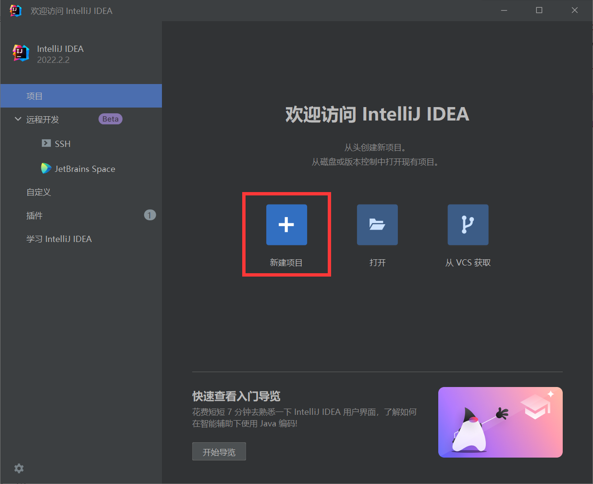
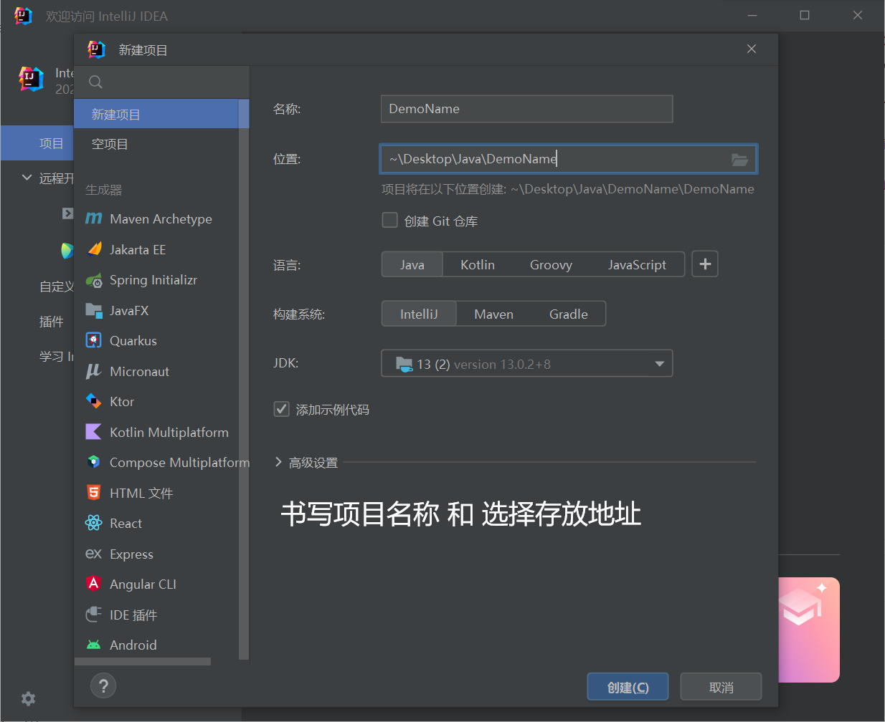
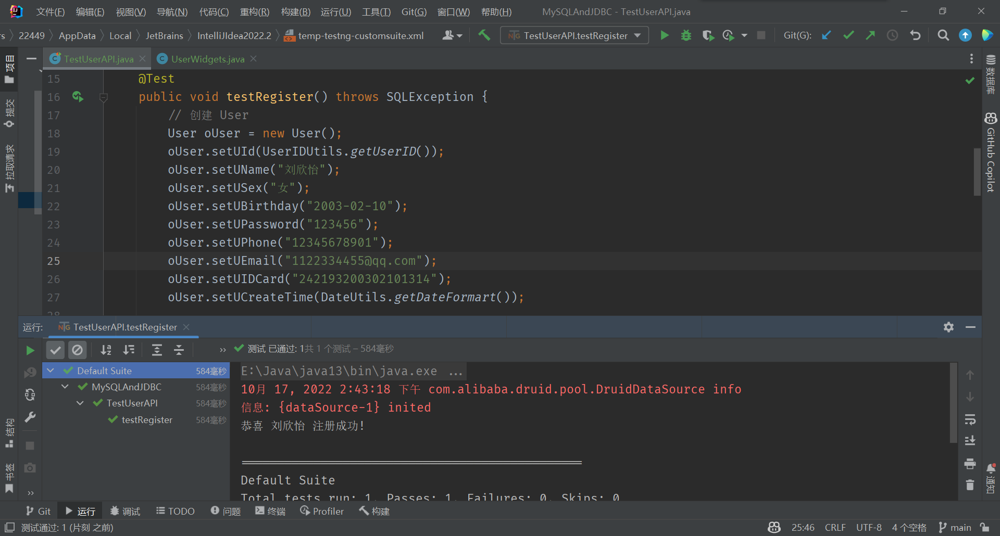
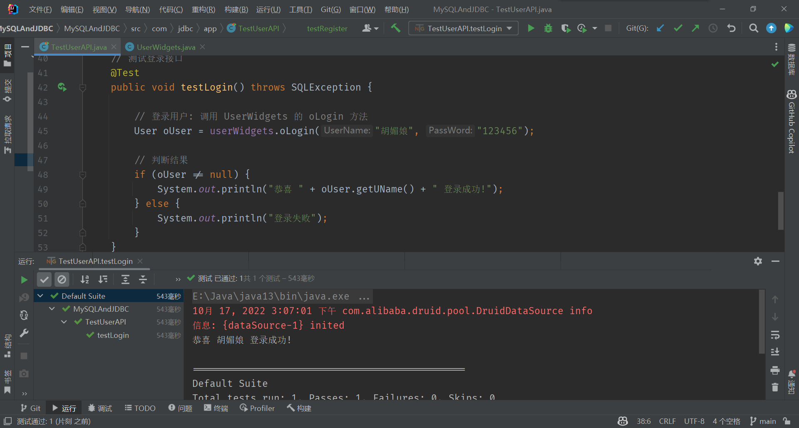
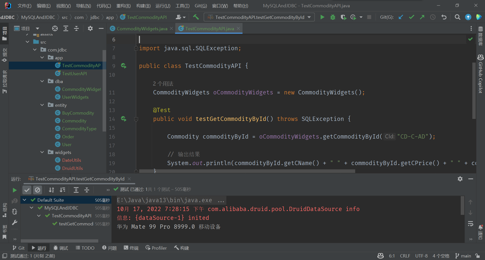
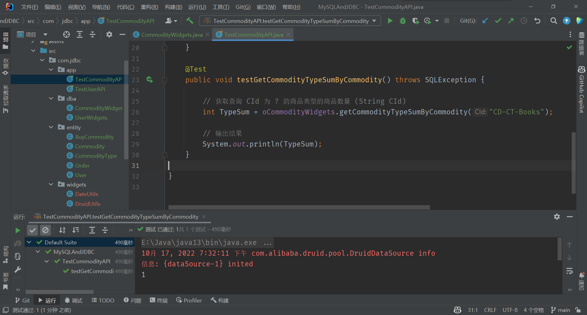
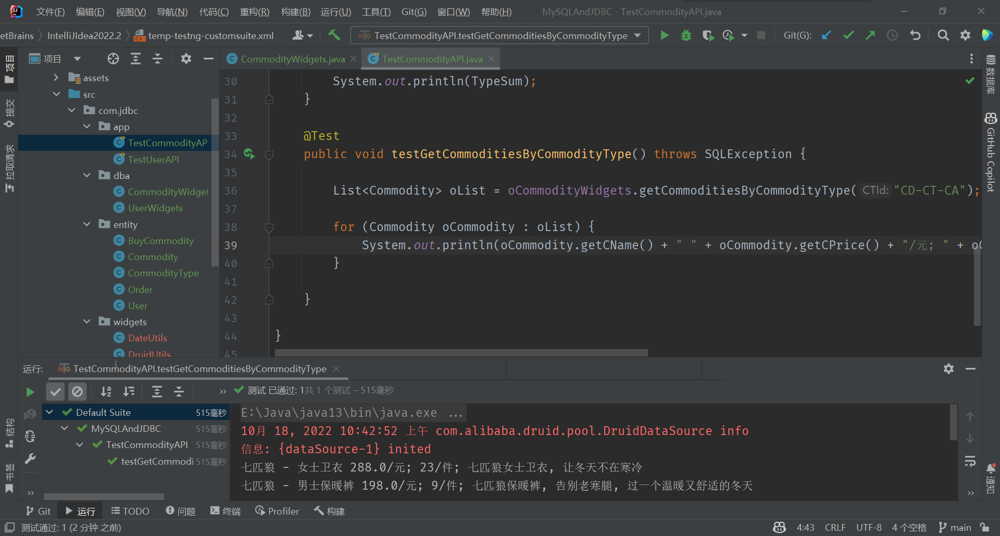
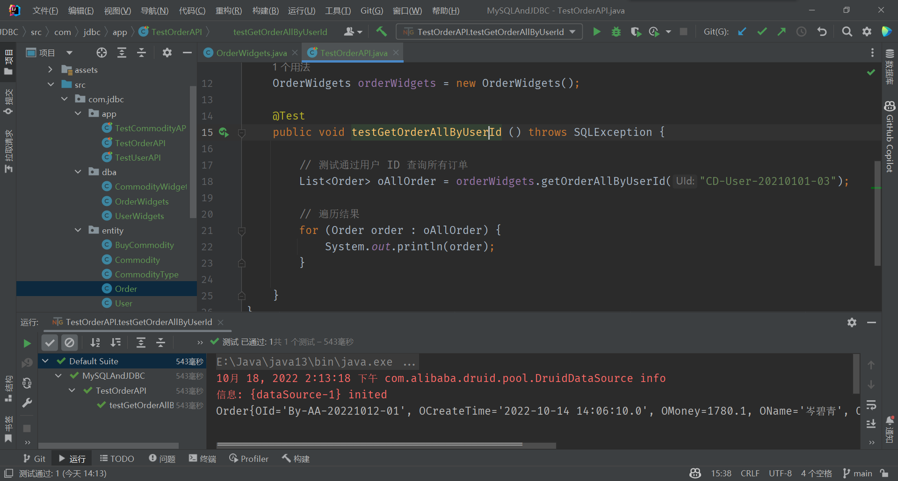
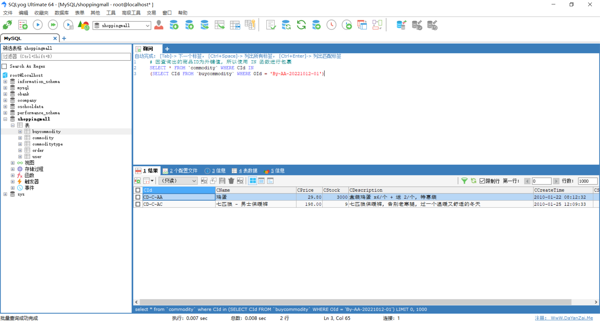

# 商城案例 ( 后端 )

---

## 1. 简介

- 这是一个简单的数据库案例, 操作难度一般
- 该案例为商城案例

---

## 2. 创建数据库

- 使用查询创建数据库

```sql
-- 判断是否存在 ShoppingMall 数据库, 不存在则创建
CREATE DATABASE IF NOT EXISTS `ShoppingMall` CHARACTER SET utf8mb4 COLLATE utf8mb4_general_ci;
```

---

## 3. 创建表

- 此处使用查询创建方式, 创建表格

### 1) 创建用户表

```sql
-- 创建一个 User 表 用户表
CREATE TABLE IF NOT EXISTS `User` (
    UId VARCHAR(50) NOT NULL PRIMARY KEY COMMENT '用户 ID',
    UName VARCHAR(20) NOT NULL COMMENT '用户名',
    USex VARCHAR(10) NOT NULL COMMENT '用户性别',
    UBirthday DATE NOT NULL COMMENT '用户生日',
    UPassword VARCHAR(20) NOT NULL COMMENT '用户密码',
    UPhone VARCHAR(20) NOT NULL COMMENT '用户手机号',
    UEmail VARCHAR(50) NOT NULL COMMENT '用户邮箱',
    UIDCard VARCHAR(20) COMMENT '用户身份证号',
    UCreateTime TIMESTAMP NOT NULL DEFAULT CURRENT_TIMESTAMP COMMENT '用户创建时间'  
);
```

- 此处为了后期使用, 插入虚拟数据 ( ※ 注: 信息如有雷同纯属巧合! )

```sql
-- 插入数据
INSERT INTO `User` VALUES
('CD-User-20210101-01', '胡丽英', '女', '1998-12-22', '123456', '12345678901', '1122334455@qq.com', '111222199812223239', NULL),
('CD-User-20210101-02', '白素贞', '女', '1999-03-25', '123456', '12345678901', '1122334455@qq.com', NULL, NULL),
('CD-User-20210101-03', '岑碧青', '女', '2002-08-13', '123456', '12345678901', '1122334455@qq.com', '223112200208131232', NULL),
('CD-User-20210101-04', '孙悟空', '男', '2021-10-19', '123456', '12345678901', '1122334455@qq.com', '667997202110191024', NULL),
('CD-User-20210101-05', '胡小唯', '女', '1914-02-28', '123456', '12345678901', '1122334455@qq.com', NULL, NULL),
('CD-User-20210101-06', '猪八戒', '男', '2019-02-01', '123456', '12345678901', '1122334455@qq.com', NULL, NULL),
('CD-User-20221102-01', '黄贵蓉', '女', '1999-01-21', '123456', '12345678901', '1122334455@qq.com', NULL, NULL);
```

### 2) 创建订单表

```sql
CREATE TABLE IF NOT EXISTS `Order` (
    OId VARCHAR(50) NOT NULL PRIMARY KEY COMMENT '订单 ID',
    OCreateTime TIMESTAMP NOT NULL DEFAULT CURRENT_TIMESTAMP COMMENT '订单创建时间',
    OMoney DOUBLE(10,2) NOT NULL COMMENT '订单金额',
    OName VARCHAR(20) NOT NULL COMMENT '收货人姓名',
    OPhone VARCHAR(20) NOT NULL COMMENT '收货人手机号',
    OAddress VARCHAR(100) NOT NULL COMMENT '收货人地址',
    OStatus INT(2) NOT NULL COMMENT '订单状态 0 未支付 1 已支付',
    UId VARCHAR(50) NOT NULL COMMENT '用户 ID',
    CONSTRAINT LinkUId FOREIGN KEY (UId) REFERENCES USER (UId) ON DELETE CASCADE
);
```

- 此处也是同理, 插入数据

```sql
-- 插入数据 By: 购买者 AA: 序号 [A-Z][A-Z]
INSERT INTO `Order` VALUES
("By-AA-20221012-01", NULL, 1780.10, '岑碧青', '11223344556', '福建省厦门市', 1, 'CD-User-20210101-03');
```

### 3) 创建商品类表

```sql
-- 创建 CommodityType 表 商品分类别表
CREATE TABLE IF NOT EXISTS `CommodityType` (
    CTId VARCHAR(50) NOT NULL PRIMARY KEY COMMENT '商品分类 ID',
    CTName VARCHAR(20) NOT NULL DEFAULT '未分类' COMMENT '商品分类名称',
    CTCreateTime TIMESTAMP NOT NULL DEFAULT CURRENT_TIMESTAMP COMMENT '商品分类创建时间'
);
```

- 为表格添加商品

```sql
- 插入数据 CD: CreateData 创建数据, CT: CommodityType 商品分类
INSERT INTO `CommodityType` VALUES
("CD-CT-Food", "食品类", '2010-07-01 11:55:11'),
-- Mobile Devices 移动设备
("CD-CT-MD", "移动设备", '2010-10-12 14:12:03'),
-- Household Electric Appliances 家用电器
("CD-CT-HEA", "家用电器", '2011-11-02 14:12:03'),
-- Clothes And Accessories 服装类
("CD-CT-CA", "服装类", '2012-02-28 12:17:34'),
-- Kitchen Supplies 厨房用品
("CD-CT-KP", "厨房用品", '2017-11-02 23:02:21'),
-- Books 图书类
("CD-CT-Books", "图书类", '2019-10-12 21:11:32');
```

### 4) 创建商品表

```sql
-- 创建 Commodity 表 商品表
CREATE TABLE IF NOT EXISTS `Commodity` (
    CId VARCHAR(50) NOT NULL PRIMARY KEY COMMENT '商品 ID',
    CName VARCHAR(20) NOT NULL COMMENT '商品名称',
    CPrice DOUBLE(10,2) NOT NULL COMMENT '商品价格',
    CStock INT(10) NOT NULL COMMENT '商品库存',
    CDescription VARCHAR(100) NOT NULL COMMENT '商品描述',
    CCreateTime TIMESTAMP NOT NULL DEFAULT CURRENT_TIMESTAMP COMMENT '商品创建时间',
    CStatus INT(1) DEFAULT 0 COMMENT "商品状态 0 下架 1 上架",
    CTId VARCHAR(50) NOT NULL COMMENT '商品分类 ID',
    CONSTRAINT LinkCTId FOREIGN KEY (CTId) REFERENCES CommodityType (CTId) ON DELETE CASCADE
);
```

- 为其添加商品

```sql
-- 插入数据 CD: CreateData 创建数据, C: Commodity 商品 + [A-Z][A-Z]
INSERT INTO `Commodity` VALUES
('CD-C-AA', '鸡蛋', 29.80, 3000, '盒装鸡蛋 x6/个 + 送 2/个, 特惠装', '2010-01-22 08:12:32', 1, 'CD-CT-Food'),
('CD-C-AB', '七只狐 - 女士卫衣', 288.00, 23, '七只狐女士卫衣, 让冬天不在寒冷', '2010-01-25 12:09:01', 1, 'CD-CT-CA'),
('CD-C-AC', '七只狐 - 男士保暖裤', 198.00, 9, '七只狐保暖裤, 告别老寒腿, 过一个温暖又舒适的冬天', '2010-01-25 12:09:33', 1, 'CD-CT-CA'),
('CD-C-AD', '华维 Copilot 99 Pro', 8999.00, 100, '华为限量 Mate 99 Pro 魔法少女樱联动, 新款顶配火热销售中', '2010-07-01 07:02,58', 1, 'CD-CT-MD'),
('CD-C-AE', '《可爱过敏原》-- 稚楚', 59.80, 289, '乐知时是和一场暴风雨一起毫无征兆的来到宋煜身边的', '2011-01-01 08:12:33', 1, 'CD-CT-Books');

```

### 5) 创建购物表

- 实际中该表不是唯一的, 一个人下单产生一张表, 该表仅限于某一个人的某一次订单

```sql
-- 创建 BuyCommodity 表 购买商品表
CREATE TABLE IF NOT EXISTS `BuyCommodity` (
    BCId VARCHAR(50) NOT NULL PRIMARY KEY COMMENT '购买商品 ID',
    CId VARCHAR(50) NOT NULL COMMENT '商品 ID ( 外键 )',
    OId VARCHAR(50) NOT NULL COMMENT '订单 ID ( 外键 )',
    BCNum INT(10) NOT NULL DEFAULT 1 COMMENT '购买商品数量',
    CONSTRAINT LinkCId FOREIGN KEY (CId) REFERENCES `Commodity` (CId) ON DELETE CASCADE,
    CONSTRAINT LinkOId FOREIGN KEY (OId) REFERENCES `Order` (OId) ON DELETE CASCADE
);
```

---

## 4. 创建 Java

- 创建一个新的 Java 项目



- 点击新建项目后, 开始书写 项目名称 和 选择该项目的存放位置



---

## 5. 创建目录

- 在创建好的 Java 项目中的 src => com => jdbc 文件夹下分别创建: 
  - app ( 文件夹 )
  - dba ( 数据库管理文件夹 )
  - entity ( 实体类存放文件夹 )
  - widgets ( 工具类文件夹, 也可以使用 Utils )
- 再在与 src 同级目录下创建 assets ( Or: resources ) 公共组件文件夹, 用于存放公共资源的

---

## 6. 配置数据库地址

- 在 assets ( Or: resources ) 文件夹下创建一个 druid.properties 文件, 用于管理数据库地址等信息

``` properties
driverClassName=com.mysql.jdbc.Driver
url=jdbc:mysql://127.0.0.1:3306/ShoppingMall?characterEncoding=UTF-8
username=root
password=123456
initialSize=5
maxActive=10
maxWait=3000
```

---

## 7. 创建实体类

- 接下来分别创建实体类

### 1) User ( 用户 )

- 创建用户实体类, 并分别创建 GET 方法 和 SET 方法, 以及 toString 方法

```java
package com.jdbc.entity;

/*
 * UId VARCHAR(50) => String => 用户 ID
 * UName VARCHAR(20) => String => 用户名
 * USex VARCHAR(10) => String => 用户性别
 * UBirthday DATE => Date => 用户生日
 * UPassword VARCHAR(20) => String => 用户密码
 * UPhone VARCHAR(20) => String => 用户电话
 * UEmail  VARCHAR(50) => String => 用户邮箱
 * UIDCard VARCHAR(20) => String => 用户身份证号
 * UCreateTime TIMESTAMP => Timestamp => 用户创建时间
 */


public class User{
    private String UId;
    private String UName;
    private String USex;
    private String UBirthday;
    private String UPassword;
    private String UPhone;
    private String UEmail;
    private String UIDCard;
    private String UCreateTime;

    public String getUId() {
        return UId;
    }

    public void setUId(String UId) {
        this.UId = UId;
    }

    public String getUName() {
        return UName;
    }

    public void setUName(String UName) {
        this.UName = UName;
    }

    public String getUSex() {
        return USex;
    }

    public void setUSex(String USex) {
        this.USex = USex;
    }

    public String getUBirthday() {
        return UBirthday;
    }

    public void setUBirthday(String UBirthday) {
        this.UBirthday = UBirthday;
    }

    public String getUPassword() {
        return UPassword;
    }

    public void setUPassword(String UPassword) {
        this.UPassword = UPassword;
    }

    public String getUPhone() {
        return UPhone;
    }

    public void setUPhone(String UPhone) {
        this.UPhone = UPhone;
    }

    public String getUEmail() {
        return UEmail;
    }

    public void setUEmail(String UEmail) {
        this.UEmail = UEmail;
    }

    public String getUIDCard() {
        return UIDCard;
    }

    public void setUIDCard(String UIDCard) {
        this.UIDCard = UIDCard;
    }

    public String getUCreateTime() {
        return UCreateTime;
    }

    public void setUCreateTime(String UCreateTime) {
        this.UCreateTime = UCreateTime;
    }

    @Override
    public String toString() {
        return "User{" +
                "UId='" + UId + '\'' +
                ", UName='" + UName + '\'' +
                ", USex='" + USex + '\'' +
                ", UBirthday='" + UBirthday + '\'' +
                ", UPassword='" + UPassword + '\'' +
                ", UPhone='" + UPhone + '\'' +
                ", UEmail='" + UEmail + '\'' +
                ", UIDCard='" + UIDCard + '\'' +
                ", UCreateTime='" + UCreateTime + '\'' +
                '}';
    }
}

```

### 2) Order ( 订单 )

- 创建订单表的实体类, 并分别创建 GET 方法 和 SET 方法, 以及 toString 方法, 此处需要注意的是:
  1. LinkUId = this.UId + User.UId &  this.UId === User.UId; 所以将 User 类进入本表
  2. User 类需要制作 GET 和 SET 方法, 但不需要做 toString 方法
- 引入 User 类

```java
// 引入 User.java 为了更加便捷的后期操作
private User user;
```

- 创建 Order 类

```java
package com.jdbc.entity;

/*
 * 订单表:
 *     OId VARCHAR(50) => String => 订单 ID
 *     OCreateTime TIMESTAMP => Timestamp => 订单创建时间
 *     OMoney DOUBLE(10,2) => double => 订单金额
 *     OName VARCHAR(50) => String => 订单名称
 *     OPhone VARCHAR(20) => String => 订单电话
 *     OAddress VARCHAR(100) => String => 订单地址
 *     OStatus INT(2) => String => 订单状态
 *     UId VARCHAR(50) => String => 用户 ID => User.UId ( KEY )
 */

public class Order {

    private String OId;
    private String OCreateTime;
    private double OMoney;
    private String OName;
    private String OPhone;
    private String OAddress;
    private String OStatus;
    private String UId;

    private User user; // 一个订单对应一个用户, 此处引入用户 ( User ) 对象

    public String getOId() {
        return OId;
    }

    public void setOId(String OId) {
        this.OId = OId;
    }

    public String getOCreateTime() {
        return OCreateTime;
    }

    public void setOCreateTime(String OCreateTime) {
        this.OCreateTime = OCreateTime;
    }

    public double getOMoney() {
        return OMoney;
    }

    public void setOMoney(double OMoney) {
        this.OMoney = OMoney;
    }

    public String getOName() {
        return OName;
    }

    public void setOName(String OName) {
        this.OName = OName;
    }

    public String getOPhone() {
        return OPhone;
    }

    public void setOPhone(String OPhone) {
        this.OPhone = OPhone;
    }

    public String getOAddress() {
        return OAddress;
    }

    public void setOAddress(String OAddress) {
        this.OAddress = OAddress;
    }

    public String getOStatus() {
        return OStatus;
    }

    public void setOStatus(String OStatus) {
        this.OStatus = OStatus;
    }

    public String getUId() {
        return UId;
    }

    public void setUId(String UId) {
        this.UId = UId;
    }

    public User getUser() {
        return user;
    }

    public void setUser(User user) {
        this.user = user;
    }

    @Override
    public String toString() {
        return "Order{" +
                "OId='" + OId + '\'' +
                ", OCreateTime='" + OCreateTime + '\'' +
                ", OMoney=" + OMoney +
                ", OName='" + OName + '\'' +
                ", OPhone='" + OPhone + '\'' +
                ", OAddress='" + OAddress + '\'' +
                ", OStatus='" + OStatus + '\'' +
                ", UId='" + UId + '\'' +
                '}';
    }
}

```

### 3) CommodityType ( 商品类型 )

- 创建一个商品类型的类, 内部主要记录的是商品的类型, 为了后期使用便利, 同样创建 GET 和 SET 方法, 以及 toString 方法

```java
package com.jdbc.entity;

/*
 * 商品分类表:
 *     CTId VARCHAR(50) => String => 商品分类 ID
 *     CTName VARCHAR(20) => String => 商品分类名称
 *     CTCreateTime TIMESTAMP => String => 商品分类创建时间
 */

public class CommodityType {

    private String CTId;
    private String CTName;
    private String CTCreateTime;

    @Override
    public String toString() {
        return "CommodityType{" +
                "CTId='" + CTId + '\'' +
                ", CTName='" + CTName + '\'' +
                ", CTCreateTime='" + CTCreateTime + '\'' +
                '}';
    }

    public String getCTId() {
        return CTId;
    }

    public void setCTId(String CTId) {
        this.CTId = CTId;
    }

    public String getCTName() {
        return CTName;
    }

    public void setCTName(String CTName) {
        this.CTName = CTName;
    }

    public String getCTCreateTime() {
        return CTCreateTime;
    }

    public void setCTCreateTime(String CTCreateTime) {
        this.CTCreateTime = CTCreateTime;
    }
}

```

### 4) Commodity ( 商品 )

- 创建商品类, 对其同样创建 GET、SET  和 toString 方法, 且内部的外键值同样需要创建 引入类 和 GET、SET 方法

```java
package com.jdbc.entity;

/*
 * 商品表
 *     CId VARCHAR(50) => String => 商品 ID
 *     CName VARCHAR(20) => String => 商品名称
 *     CPrice DOUBLE(10,2) => double => 商品价格
 *     CStock INT(10) => int => 商品库存
 *     CDescription VARCHAR(100) => String => 商品描述
 *     CCreateTime TIMESTAMP => String => 商品创建时间
 *     CStatus INT(1) => int => 商品状态
 *     CTId VARCHAR(50) => String => 商品分类 ID => CommodityType.CTId ( KEY )
 */

public class Commodity {
    private String CId;
    private String CName;
    private double CPrice;
    private int CStock;
    private String CDescription;
    private String CCreateTime;
    private int CStatus;
    private String CTId;

    private CommodityType commodityType; // 保存分类的详细信息

    public String getCId() {
        return CId;
    }

    public void setCId(String CId) {
        this.CId = CId;
    }

    public String getCName() {
        return CName;
    }

    public void setCName(String CName) {
        this.CName = CName;
    }

    public double getCPrice() {
        return CPrice;
    }

    public void setCPrice(double CPrice) {
        this.CPrice = CPrice;
    }

    public int getCStock() {
        return CStock;
    }

    public void setCStock(int CStock) {
        this.CStock = CStock;
    }

    public String getCDescription() {
        return CDescription;
    }

    public void setCDescription(String CDescription) {
        this.CDescription = CDescription;
    }

    public String getCCreateTime() {
        return CCreateTime;
    }

    public void setCCreateTime(String CCreateTime) {
        this.CCreateTime = CCreateTime;
    }

    public int getCStatus() {
        return CStatus;
    }

    public void setCStatus(int CStatus) {
        this.CStatus = CStatus;
    }

    public String getCTId() {
        return CTId;
    }

    public void setCTId(String CTId) {
        this.CTId = CTId;
    }

    public CommodityType getCommodityType() {
        return commodityType;
    }

    public void setCommodityType(CommodityType commodityType) {
        this.commodityType = commodityType;
    }

    @Override
    public String toString() {
        return "Commodity{" +
                "CId='" + CId + '\'' +
                ", CName='" + CName + '\'' +
                ", CPrice=" + CPrice +
                ", CStock=" + CStock +
                ", CDescription='" + CDescription + '\'' +
                ", CCreateTime='" + CCreateTime + '\'' +
                ", CStatus=" + CStatus +
                ", CTId='" + CTId + '\'' +
                '}';
    }
}

```

### 5) ByCommodity ( 购物表 )

- 创建购物表单, 每一个订单对应一个购物表单, 一个订单内可以购买多个物品, 同样该表单需要创建GET 和 SET 方法, 且该表有两个外键, 需要分别引入 OId ( 订单表的 KEY ) 和 CId ( 商品表的 KEY )

- 引入外键:

``` java
// 以下内容需要引入 GET 和 SET 方法, 不需要使用 toString
private Commodity commodity; // 保存商品的详细信息
private Order order; // 保存订单的详细信息
```

- 创建购物表类:

```java
package com.jdbc.entity;

/* 购物表
 * BCId VARCHAR(50) => String => 购物 ID
 * CId VARCHAR(50) => String => 商品 ID => Commodity.CId ( KEY )
 * OId VARCHAR(50) => String => 订单 ID => Order.OId ( KEY )
 * BCNum INT(10) => int => 购买数量
 */

public class BuyCommodity {
    private String BCId;
    private String CId;
    private String OId;

    private Commodity commodity; // 保存商品的详细信息
    private Order order; // 保存订单的详细信息

    public String getBCId() {
        return BCId;
    }

    public void setBCId(String BCId) {
        this.BCId = BCId;
    }

    public String getCId() {
        return CId;
    }

    public void setCId(String CId) {
        this.CId = CId;
    }

    public String getOId() {
        return OId;
    }

    public void setOId(String OId) {
        this.OId = OId;
    }

    public Commodity getCommodity() {
        return commodity;
    }

    public void setCommodity(Commodity commodity) {
        this.commodity = commodity;
    }

    public Order getOrder() {
        return order;
    }

    public void setOrder(Order order) {
        this.order = order;
    }

    @Override
    public String toString() {
        return "BuyCommodity{" +
                "BCId='" + BCId + '\'' +
                ", CId='" + CId + '\'' +
                ", OId='" + OId + '\'' +
                '}';
    }
}

```

---

## 8. 用户类

### 1) User 注册

#### 1.1 用户注册

- 配置用户注册:

```sql
# 此处每一个值都需要使用所以就省略了 User(UId, ...) VALUED(...)
# 共计 9 个值, [UId, UName, USex, UBirthday, UPassword, UPhone, UEmail, UIDCard, UCreateTime]
INSERT INTO `User` VALUES (?, ?, ?, ?, ?, ?, ?, ?, ?)
```

- 注册类的书写:

``` java
package com.jdbc.dba;

import com.jdbc.entity.User;
import org.apache.commons.dbutils.QueryRunner;
import com.jdbc.widgets.DruidUtils;
import org.apache.commons.dbutils.handlers.BeanHandler;

import java.sql.SQLException;

public class UserWidgets {
	public int oRegister(User user) throws SQLException {

        // A. 获取 QR 对象
        QueryRunner qr = new QueryRunner(DruidUtils.dataSource);

        // B. 编写 SQL
        String sql = "INSERT INTO `User` VALUES (?, ?, ?, ?, ?, ?, ?, ?, ?)";
        // D. 设置参数
        Object[] oData = {
                // 用户 ID
                user.getUId(),
                // 用户的姓名
                user.getUName(),
                // 用户的性别
                user.getUSex(),
                // 用户的生日
                user.getUBirthday(),
                // 用户的登录密码
                user.getUPassword(),
                // 用户的手机号
                user.getUPhone(),
                // 用户邮箱
                user.getUEmail(),
                // 用户的身份证
                user.getUIDCard(),
                // 用户的注册时间
                user.getUCreateTime()
        };

        // 执行插入操作
        int update = qr.update(sql, oData);

        // 返回一个 update
        return update;
    }
}
```

#### 1.2 注册测试

- 测试刚刚写好的工具类

```java
package com.jdbc.app;

import com.jdbc.dba.UserWidgets;
import com.jdbc.entity.User;
import com.jdbc.widgets.UserIDUtils;
import org.testng.annotations.Test;
import com.jdbc.widgets.DateUtils;

import java.sql.SQLException;

public class TestUserAPI {
    UserWidgets userWidgets = new UserWidgets();

    // 测试注册接口
    @Test
    public void testRegister() throws SQLException {
        // 创建 User
        User oUser = new User();
        oUser.setUId(UserIDUtils.getUserID());
        oUser.setUName("胡媚娘");
        oUser.setUSex("女");
        oUser.setUBirthday("1992-10-21");
        oUser.setUPassword("123456");
        oUser.setUPhone("12345678901");
        oUser.setUEmail("1122334455@qq.com");
        oUser.setUIDCard("241413199210210134");
        oUser.setUCreateTime(DateUtils.getDateFormart());

        // 注册用户
        int register = userWidgets.oRegister(oUser);

        // 判断结果
        if (register > 0) {
            System.out.println("恭喜 " + oUser.getUName() + " 注册成功!");
        } else {
            System.out.println("注册失败");
        }
    }
}
```

#### 1.3 注册结果

- 运行成功



### 2)  User 登录

#### 2.1 用户登录

- 配置用户注册: 

```sql
# 搜索指定 用户名 和 密码
SELECT * FROM `User` WHERE `UName` = ? AND `UPassword` = ?
```

- 登录类的书写:

```java
package com.jdbc.dba;

import com.jdbc.entity.User;
import org.apache.commons.dbutils.QueryRunner;
import com.jdbc.widgets.DruidUtils;
import org.apache.commons.dbutils.handlers.BeanHandler;

import java.sql.SQLException;

public class UserWidgets {

    // 注册用户, 接收 User 对象
    // 省略注册类 ...

    // 登录用户, 接收 UserName 和 PassWord
    public User oLogin(String UserName, String PassWord) throws SQLException {
        // A. 获取 QR 对象
        QueryRunner qr = new QueryRunner(DruidUtils.dataSource);

        // B. 编写 SQL
        String sql = "SELECT * FROM `User` WHERE `UName` = ? AND `UPassword` = ?";
        // D. 设置参数
        Object[] oData = {
                UserName,
                PassWord
        };

        // 执行查询操作
        User user = qr.query(sql, new BeanHandler<User>(User.class), oData);

        return user;
    }
}

```

#### 2.2 登陆测试

- 测试用户是否能够正常登录

```java
package com.jdbc.app;

import com.jdbc.dba.UserWidgets;
import com.jdbc.entity.User;
import com.jdbc.widgets.UserIDUtils;
import org.testng.annotations.Test;
import com.jdbc.widgets.DateUtils;

import java.sql.SQLException;

public class TestUserAPI {
    UserWidgets userWidgets = new UserWidgets();

    // 测试注册接口
    // 省略注册测试 ...

    // 测试登录接口
    @Test
    public void testLogin() throws SQLException {

        // 登录用户: 调用 UserWidgets 的 oLogin 方法
        User oUser = userWidgets.oLogin("胡媚娘", "123456");

        // 判断结果
        if (oUser != null) {
            System.out.println("恭喜 " + oUser.getUName() + " 登录成功!");
        } else {
            System.out.println("登录失败");
        }
    }
}

```

#### 2.3 登录结果

- 登陆成功



---

## 9. 商品类

### 1) 获取商品

- 通过商品的 商品ID 获取商品: 商品名 价格 类型

#### 1.1 通过 ID 获取

- 商品类的书写

```java
package com.jdbc.dba;

import com.jdbc.entity.Commodity;
import com.jdbc.entity.CommodityType;
import com.jdbc.widgets.DruidUtils;
import org.apache.commons.dbutils.QueryRunner;
import org.apache.commons.dbutils.handlers.BeanHandler;
import org.apache.commons.dbutils.handlers.ScalarHandler;

import java.sql.SQLException;

public class CommodityWidgets {

    public Commodity getCommodityById(String CId) throws SQLException {

        // A. 创建 QR 对象
        QueryRunner qr = new QueryRunner(DruidUtils.getDataSource());

        // B. 编写 SQL 语句 (避免多表查询)
        // 1) 通过商品 ID 查询商品信息
        String sql = "SELECT * FROM `Commodity` WHERE `CId` = ?";

        // C. 执行查询语句
        Commodity oQuery = qr.query(sql, new BeanHandler<Commodity>(Commodity.class), CId);

        // D. 获取外键值
        String CTId = oQuery.getCTId();

        // E. 调取商品类型函数
        CommodityType oCommodityType = getCommodityTypeByCId(CTId);

        oQuery.setCommodityType(oCommodityType);

        return oQuery;
    }

    public CommodityType getCommodityTypeByCId(String CTId) throws SQLException {

        // A. 创建 QR 对象
        QueryRunner qr = new QueryRunner(DruidUtils.getDataSource());

        // B. 编写 SQL 语句 (避免多表查询)
        // 1) 通过商品 ID 查询商品信息
        String sql = "SELECT * FROM `CommodityType` WHERE `CTId` = ?";

        // C. 执行查询语句
        CommodityType oQuery = qr.query(sql, new BeanHandler<CommodityType>(CommodityType.class), CTId);

        // D. 返回结果 商品类型
        return oQuery;
    }
}
```

#### 1.2 测试商品类

```java
package com.jdbc.app;

import com.jdbc.dba.CommodityWidgets;
import com.jdbc.entity.Commodity;
import org.testng.annotations.Test;

import java.sql.SQLException;

public class TestCommodityAPI {

    CommodityWidgets oCommodityWidgets = new CommodityWidgets();

    @Test
    public void testGetCommodityById() throws SQLException {

        Commodity commodityById = oCommodityWidgets.getCommodityById("CD-C-AD");

        // 输出结果
        System.out.println(commodityById.getCName() + " " + commodityById.getCPrice() + " " + commodityById.getCommodityType().getCTName());
    }
}
```

#### 1.3 查询结果

- 测试成功:



### 2) 查询类别商品总和

- 查询某一种类别的商品总共有多少个

#### 2.1 查询总和

```java
package com.jdbc.dba;

import com.jdbc.entity.Commodity;
import com.jdbc.entity.CommodityType;
import com.jdbc.widgets.DruidUtils;
import org.apache.commons.dbutils.QueryRunner;
import org.apache.commons.dbutils.handlers.BeanHandler;
import org.apache.commons.dbutils.handlers.ScalarHandler;

import java.sql.SQLException;

public class CommodityWidgets {

    // 通过 ID 查询商品的名称和价格, 嵌套下方查询商品的类型 ...

    // 查询商品的类型 ...

    public int getCommodityTypeSumByCommodity(String CId) throws SQLException {

            // A. 创建 QR 对象
            QueryRunner qr = new QueryRunner(DruidUtils.getDataSource());

            // B. 编写 SQL 语句 (避免多表查询)
            // 1) 通过商品 ID 查询商品信息
            String sql = "SELECT COUNT(*) FROM `Commodity` WHERE `CTId` = ?";

            // C. 执行查询语句
            Long oQuery = qr.query(sql, new ScalarHandler<>(), CId);

            // D. 返回结果 商品类型
            return oQuery.intValue();
    }

}

```

#### 2.2 测试查询

```java
package com.jdbc.app;

import com.jdbc.dba.CommodityWidgets;
import com.jdbc.entity.Commodity;
import org.testng.annotations.Test;

import java.sql.SQLException;

public class TestCommodityAPI {

    CommodityWidgets oCommodityWidgets = new CommodityWidgets();

    // 测试通过 ID 查询商品名、价格、类别

    @Test
    public void testGetCommodityTypeSumByCommodity() throws SQLException {

        // 获取查询 CId 为 ? 的商品类型的商品数量 (String CId)
        int TypeSum = oCommodityWidgets.getCommodityTypeSumByCommodity("CD-CT-Books");

        // 输出结果
        System.out.println(TypeSum);
    }

}

```

#### 2.3 测试结果

- 测试成功:



### 3) 查询商品类别详情

- 查询某一种类商品下所有商品的详情

#### 3.1 查询详情

- 查询语句:

```sql
"SELECT * FROM `Commodity` WHERE `CTId` = ?
```

- 查询商品类:

```java
package com.jdbc.dba;

import com.jdbc.entity.Commodity;
import com.jdbc.entity.CommodityType;
import com.jdbc.widgets.DruidUtils;
import org.apache.commons.dbutils.QueryRunner;
import org.apache.commons.dbutils.handlers.BeanHandler;
import org.apache.commons.dbutils.handlers.BeanListHandler;
import org.apache.commons.dbutils.handlers.ScalarHandler;

import java.sql.SQLException;
import java.util.List;

public class CommodityWidgets {
    // 查找指定 ID 的商品: 获得商品名称、价格
    // 略...

    // 获取指定商品的商品类型: 通过商品的 KEY 外键
    // 略...

    // 获取指定商品类型的商品数量( 不是库存 )
    // 略...
    
    // 获取指定分类下的所有商品详情 ( Commodity => 复数形式 => Commodities )
    public List<Commodity> getCommoditiesByCommodityType(String CTId) throws SQLException {

        // A. 创建 QR 对象
        QueryRunner qr = new QueryRunner(DruidUtils.getDataSource());

        // B. 编写 SQL 语句 (避免多表查询)
        // 1) 通过商品 ID 查询商品信息
        String sql = "SELECT * FROM `Commodity` WHERE `CTId` = ?";

        // C. 执行查询语句
        List<Commodity> oList = qr.query(sql, new BeanListHandler<Commodity>(Commodity.class), CTId);

        // D. 返回结果 商品类型
        return oList;
    }

}

```

#### 3.2 测试类

- 测试以上查询类是否能够查询到指定类型的所有商品详情

```java
package com.jdbc.app;

import com.jdbc.dba.CommodityWidgets;
import com.jdbc.entity.Commodity;
import org.testng.annotations.Test;

import java.sql.SQLException;
import java.util.List;

public class TestCommodityAPI {

    CommodityWidgets oCommodityWidgets = new CommodityWidgets();
    // 略...
    
    // 略...

    @Test
    public void testGetCommoditiesByCommodityType() throws SQLException {

        List<Commodity> oList = oCommodityWidgets.getCommoditiesByCommodityType("CD-CT-CA");

        for (Commodity oCommodity : oList) {
            System.out.println(oCommodity.getCName() + " " + oCommodity.getCPrice() + "/元; " + oCommodity.getCStock() + "/件; " + oCommodity.getCDescription());
        }

    }

}

```

#### 3.3 查询结果

- 查询成功



---

## 10. 订单类

- 订单表为 1 对 多 的表
- 将 Order 表添加一条一对多的项

```java
package com.jdbc.entity;

/*
 * 订单表:
 *     OId VARCHAR(50) => String => 订单 ID
 *     OCreateTime TIMESTAMP => Timestamp => 订单创建时间
 *     OMoney DOUBLE(10,2) => double => 订单金额
 *     OName VARCHAR(50) => String => 订单名称
 *     OPhone VARCHAR(20) => String => 订单电话
 *     OAddress VARCHAR(100) => String => 订单地址
 *     OStatus INT(2) => String => 订单状态
 *     UId VARCHAR(50) => String => 用户 ID => User.UId ( KEY )
 */

import java.util.ArrayList;
import java.util.List;

public class Order {

    private String OId;
    private String OCreateTime;
    private double OMoney;
    private String OName;
    private String OPhone;
    private String OAddress;
    private String OStatus;
    private String UId;

    // 一个订单中包含了多个订单项的信息
    List<BuyCommodity> oList = new ArrayList<>(); // <= 这时新增项

    private User user; // 一个订单对应一个用户, 此处引入用户 ( User ) 对象

    public String getOId() {
        return OId;
    }

    public void setOId(String OId) {
        this.OId = OId;
    }

    public String getOCreateTime() {
        return OCreateTime;
    }

    public void setOCreateTime(String OCreateTime) {
        this.OCreateTime = OCreateTime;
    }

    public double getOMoney() {
        return OMoney;
    }

    public void setOMoney(double OMoney) {
        this.OMoney = OMoney;
    }

    public String getOName() {
        return OName;
    }

    public void setOName(String OName) {
        this.OName = OName;
    }

    public String getOPhone() {
        return OPhone;
    }

    public void setOPhone(String OPhone) {
        this.OPhone = OPhone;
    }

    public String getOAddress() {
        return OAddress;
    }

    public void setOAddress(String OAddress) {
        this.OAddress = OAddress;
    }

    public String getOStatus() {
        return OStatus;
    }

    public void setOStatus(String OStatus) {
        this.OStatus = OStatus;
    }

    public String getUId() {
        return UId;
    }

    public void setUId(String UId) {
        this.UId = UId;
    }

    public User getUser() {
        return user;
    }

    public void setUser(User user) {
        this.user = user;
    }

    @Override
    public String toString() {
        return "Order{" +
                "OId='" + OId + '\'' +
                ", OCreateTime='" + OCreateTime + '\'' +
                ", OMoney=" + OMoney +
                ", OName='" + OName + '\'' +
                ", OPhone='" + OPhone + '\'' +
                ", OAddress='" + OAddress + '\'' +
                ", OStatus='" + OStatus + '\'' +
                ", UId='" + UId + '\'' +
                '}';
    }
}

```

### 1) 获取指定用户订单

- 获取指定用户的所有订单信息

#### 1.1 获取用户订单

``` 
package com.jdbc.dba;

import com.jdbc.entity.Order;
import com.jdbc.widgets.DruidUtils;
import org.apache.commons.dbutils.QueryRunner;
import org.apache.commons.dbutils.handlers.BeanListHandler;

import java.sql.SQLException;
import java.util.List;

public class OrderWidgets {

    // 通过用户 ID 查询所有订单
    public List<Order> getOrderAllByUserId (String UId) throws SQLException {

        // 创建 QR 对象
        QueryRunner qr = new QueryRunner(DruidUtils.getDataSource());

        // 书写 SQL 语句
        String SQL = "SELECT * FROM `Order` WHERE `UId` = ?";

        // 执行 SQL 语句
        List<Order> OrderList = qr.query(SQL, new BeanListHandler<Order>(Order.class), UId);

        // 返回结果
        return OrderList;

    }
}

```

#### 1.2 测试类

- 测试获取用户订单类是否可以正常获取到用户的订单

```java
package com.jdbc.app;

import com.jdbc.dba.OrderWidgets;
import com.jdbc.entity.Order;
import org.testng.annotations.Test;

import java.sql.SQLException;
import java.util.List;

public class TestOrderAPI {

    OrderWidgets orderWidgets = new OrderWidgets();

    @Test
    public void testGetOrderAllByUserId () throws SQLException {

        // 测试通过用户 ID 查询所有订单
        List<Order> oAllOrder = orderWidgets.getOrderAllByUserId("CD-User-20210101-03");

        // 遍历结果
        for (Order order : oAllOrder) {
            System.out.println(order);
        }

    }
}

```

#### 1.3 测试结果

- 成功输出指定 UID ( 用户 ID )的订单信息



### 2) 获取订单编号的购买详情

- 获取指定订单编号的购买详情

- SQL 搜索:

```sql
# 搜索购买项表中的 OId ( Order 订单表 ) 以便查询指定订单项
SELECT * FROM `buycommodity` WHERE OId = 'By-AA-20221012-01';

# 搜索购买表中 OId 产生的 CId ( Commodity 商品表 )
SELECT CId FROM `buycommodity` WHERE OId = 'By-AA-20221012-01';

# 测试 CID
SELECT * FROM `commodity` WHERE CId = 'CD-C-AA';

# 测试 CID2
SELECT * FROM `commodity` WHERE CId = 'CD-C-AC';

# 因查询出的商品ID为外键值, 所以使用 IN 函数进行包裹
SELECT * FROM `commodity` WHERE CId IN
(SELECT CId FROM `buycommodity` WHERE OId = 'By-AA-20221012-01')

```

※ 如图所示:



#### 2.1 查询类

- 书写 Java 查询类:

``` java
package com.jdbc.dba;

import com.jdbc.entity.BuyCommodity;
import com.jdbc.entity.Commodity;
import com.jdbc.entity.CommodityType;
import com.jdbc.entity.Order;
import com.jdbc.widgets.DruidUtils;
import org.apache.commons.dbutils.QueryRunner;
import org.apache.commons.dbutils.handlers.BeanListHandler;

import java.sql.SQLException;
import java.util.ArrayList;
import java.util.List;

public class OrderWidgets {

    // 通过用户 ID 查询所有订单
    // 略...

    // 获取指定订单编号中的所有商品信息
    public List<Commodity> getCommodityAllByOrderId(String OId) throws SQLException {

        // 创建 QR 对象
        QueryRunner qr = new QueryRunner(DruidUtils.getDataSource());

        // 书写 SQL 语句
        String SQL = "SELECT * FROM `BuyCommodity` WHERE `OId` = ?";

        // 执行 SQL 语句
        List<BuyCommodity> oList = qr.query(SQL, new BeanListHandler<BuyCommodity>(BuyCommodity.class), OId);

        // 查询商品信息
        // 创建集合保存商品信息
        List<Commodity> CommodityList = new ArrayList<>();

        // 定义 CommodityWidgets 对象
        CommodityWidgets commodityWidgets = new CommodityWidgets();

        // 遍历订单项集合, 获取 CId
        for (BuyCommodity buyCommodity : oList) {

            // 获取 CId
            String CId = buyCommodity.getCId();

            // 调用商品 API, 通过商品 ID 查询商品信息
            // 也就是 CommodityWidgets 工具类中的 getCommodityById 这个小类
            Commodity Commodities = commodityWidgets.getCommodityById(CId);

            // 将商品信息添加到集合中
            CommodityList.add(Commodities);

        }

        // 返回值
        return CommodityList;
    }
}

```

#### 2.2 测试查询类

```java
package com.jdbc.app;

import com.jdbc.dba.OrderWidgets;
import com.jdbc.entity.Commodity;
import com.jdbc.entity.Order;
import org.testng.annotations.Test;

import java.sql.SQLException;
import java.util.List;

public class TestOrderAPI {

    OrderWidgets orderWidgets = new OrderWidgets();

    // 第一个查询测试...( 略 )

    @Test
    public void testGetCommodityAllByOrderId() throws SQLException {
        List<Commodity> cAllCommodity = orderWidgets.getCommodityAllByOrderId("By-AA-20221012-01");
        for (Commodity commodity : cAllCommodity) {
            System.out.println(commodity);
        }
    }
}

```

#### 2.3 查询结果

- 通过测试得出具体的订单内容, 测试成功


---

## 总结

- 在实际操作中绝对!!!( important ) 不要使用物理外键, 避免后期出现更多麻烦, 如需要外键则自定义即可, 不要实际创建!
  - 如 User ID 和 Order ID, 将 Order 的最后一设为用户的外键则默许即可, 不要使用 SQL 真实定义!
- 后端程序员默认包名:
  - app: 测试包, 用于对 DAO 代码的后期测试
  - dao: 数据访问层, 包含对数据库相关的操作
  - entity: 实体包, 保存根据数据库表所创建的 JavaBean 类
  - utils : 创建的工具包
