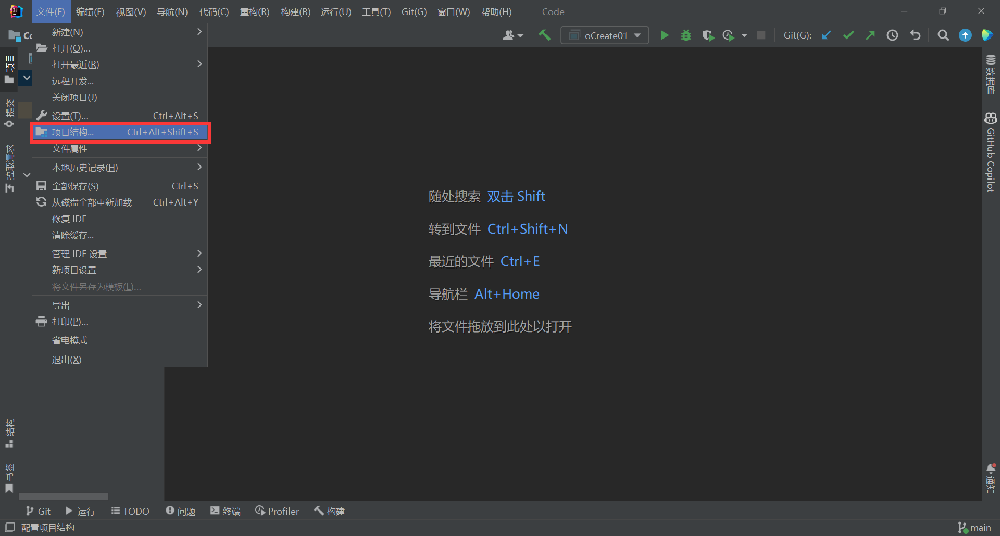
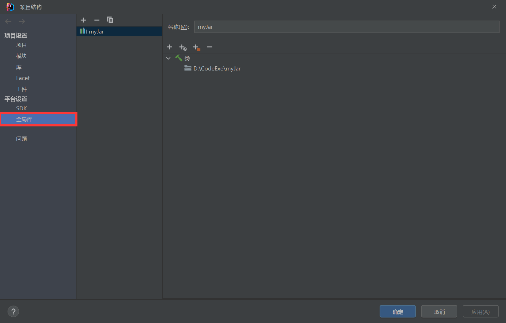
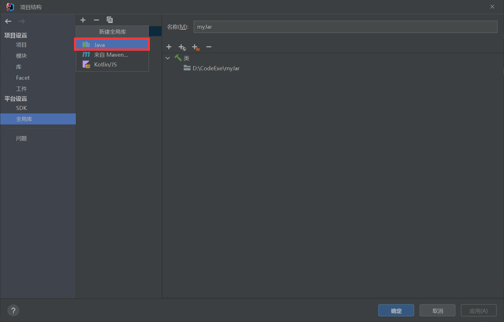
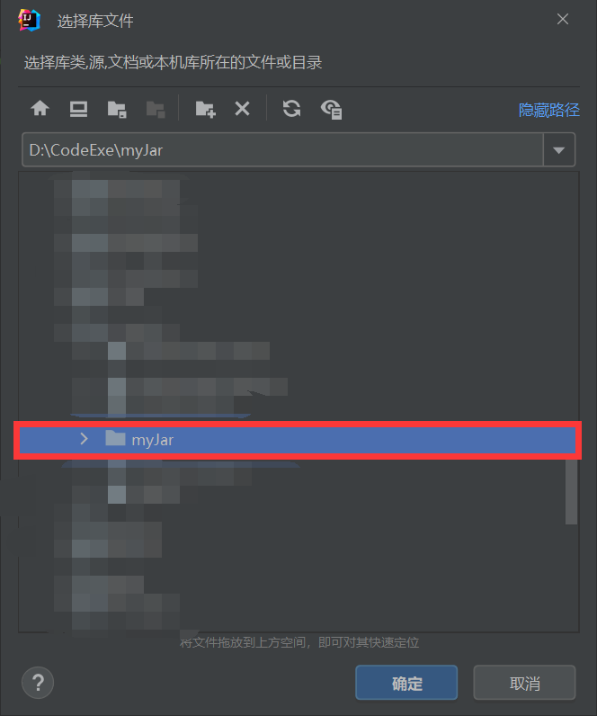

# JDBC 技术

---

## 1. 概述

- Java数据库连接，（Java Database Connectivity，简称JDBC）是Java语言中用来规范客户端程序如何来访问数据库的应用程序接口，提供了诸如查询和更新数据库中数据的方法。JDBC也是Sun Microsystems的商标。
- JDBC 是一套接口, 具体实现类是由厂商提供给我们的, 最终这些实现类被封成了一个 jar 包, 这个 jar 包就是整个数据库的驱动了。

---

## 2. 安装方法

- 将 MyJar 软件包放置于 D 盘下, 再用 IDEA 创建一个项目后, 配置项目的全局变量, 并将 MyJar 引入


	

	

	


---

## 3. 注册方式

- 创建一个新项目, 并在 src 目录下创建一个 软包, 在创建一个方法, 在方法中引入以下内容:

``` java
package com.create.jdbc;
import java.sql.DriverManager;

public class oCreate01{
    
    public static void main(String[] args) throws Exception{
        // 注册驱动 ( 可以省略, 现在暂时不建议 )
		Class.forName("com.mysql.jdbc.Driver");
    }
}
```

---

## 4. 连接方式

- 使用以下方式进行连接

```java
java.sql.Connection con = DriverManager.getConnection(String Url, String User, String PassWord)
```

- 注解

``` md
String Url
	说明: MySQL 的地址, 
	示例: 一般为 jdbc:mysql://localhost:3306/..?characterEncoding=UTF-8
String User
	说明: MySQL 的用户名,
	示例: 一般为 root
String PassWord
	说明: MySQL 的登录密码,
	示例: 一般为 123456
```

- 使用

```java
package com.create.jdbc;
import java.sql.Connection;
import java.sql.DriverManager;

public class oCreate01 {
    public static void main(String[] args) throws Exception {
        Class.forName("com.mysql.jdbc.Driver");

        String oUrl = "jdbc:mysql://localhost:3306/oSchoolData?characterEncoding=UTF-8";
        String oUser = "root";
        String oPass = "123456";

        Connection oData = DriverManager.getConnection(oUrl, oUser, oPass);

        //System.out.println(oData);
    }
}
```

---

## 5. 获取语句执行对象

- 在 Java 执行 SQL 语句的方法, 再执行之前在数据库中创建 oSchool 数据库, 并创建 oTeacher 和 oStudent, oCourse 表单 ( 详见 ./code/CreateSchool.sql )

```java
package com.create.jdbc;
import java.sql.Connection;
import java.sql.DriverManager;
import java.sql.Statement;

public class oCreate01 {
    public static void main(String[] args) throws Exception {
        Class.forName("com.mysql.jdbc.Driver");

        String oUrl = "jdbc:mysql://localhost:3306/oSchoolData?characterEncoding=UTF-8";
        String oUser = "root";
        String oPass = "123456";

        Connection oData = DriverManager.getConnection(oUrl, oUser, oPass);

        //System.out.println(oData);

        Statement oStatement = oData.createStatement();

        // 创建一张 oClass 表 => 此处是执行的语句
        String oSql = "";
        int oI = oStatement.executeUpdate(oSql);

        System.out.println(oI);

        // 关闭流
        oStatement.close();
        oData.close();
    }
}

```

- 创建 oClass 案例 ( 详见: ./code/CreateClass.sql ):

```sql
CREATE TABLE oClassScheduleCard (
    -- ID （ IsKey ）
    CSCId INT(11) NOT NULL PRIMARY KEY AUTO_INCREMENT,
    -- 课程名称
    CSCName INT NOT NULL,
    -- 选课学生
    CSCStudent INT NOT NULL,
    -- 授课老师
    CSCTeacher INT NOT NULL,
    -- 备注
    CSCRemark varchar(50),
    -- 外键 01: 课程名称 与 oCourse 的 ID 关联
    CONSTRAINT IsClass FOREIGN KEY (CSCName) REFERENCES oCourse (CId),
    -- 外键 02: 选课学生 与 oStudent 的 ID 关联
    CONSTRAINT IsStudent FOREIGN KEY (CSCStudent) REFERENCES oStudent (SId),
    -- 外键 03: 授课老师 与 oTeacher 的 ID 关联
    CONSTRAINT IsTeacher FOREIGN KEY (CSCTeacher) REFERENCES oTeacher (TId)
)
```

---

## 6. 处理结果集

- 使用 java.sql.* 处理的查询返回结果为结果集对象, 在后期处理需要对其进行遍历, 并拼接

``` java
package com.create.jdbc;
import java.sql.Connection;
import java.sql.DriverManager;
import java.sql.ResultSet;
import java.sql.Statement;

public class oCreate02 {
    public static void main(String[] args) throws  Exception {
        // 注册驱动
        Class.forName("com.mysql.jdbc.Driver");

        // 书写连接字符串
        String oUrl = "jdbc:mysql://localhost:3306/oSchoolData?characterEncoding=utf-8";

        // 获取连接
        Connection oCon = DriverManager.getConnection(oUrl, "root", "123456");

        // 获取语句执行平台
        Statement oSta = oCon.createStatement();

        // 执行sql语句: 查询 oSchoolData 数据库中的 oStudent 表中的所有数据
        String sql = "SELECT * FROM ostudent;";

        // 执行sql语句
        oSta.executeQuery(sql);

        // 获取返回值, 是结果集对象
        ResultSet oRes = oSta.executeQuery(sql);

        // 处理结果集对象
       //boolean oNext = oRes.next();
       //System.out.println(oNext);

        // 获取 ID
        //int oSId = oRes.getInt("SId");
        // 通过列名的方式获取
        //System.out.println("通过列名的方式获取: " + oSId);
        // 通过列号的方式获取
        //int oSId2 = oRes.getInt(1);
        //System.out.println("通过列号的方式获取: " + oSId2);

        // 通过 while 遍历结果集
        while(oRes.next()){
            // 获取 SId
            int SId = oRes.getInt("SId");
            // 获取 SName
            String SName = oRes.getString("SName");
            // 获取 SAge
            int SAge = oRes.getInt("SAge");
            // 获取 SSex
            String SSex = oRes.getString("SSex");

            // 输出
            System.out.println("ID: " + SId + " ; 姓名: " + SName + " ; 年龄: " + SAge + " ; 性别: " + SSex);
        }

       // Close
       oRes.close();
       oSta.close();
       oCon.close();


    }
}

```

---

## 7. 关闭流释放资源

- 在每回使用完资源后, 请记得按照顺序以此闭合

```java
package com.create.jdbc;
import java.sql.*;

public class oClose {
    public static void main(String[] args) {
        Connection oCon = null;
        Statement oSta = null;
        ResultSet oRes = null;
        try {

            oCon = DriverManager.getConnection("jdbc:mysql://localhost:3306/oSchoolData?characterEncoding=utf-8", "root", "123456");

            oSta = oCon.createStatement();

            // 创建执行语句
            String oSql = "SELECT * FROM oStudent";

            // 执行语句
            oRes = oSta.executeQuery(oSql);

        } catch (SQLException e) {
            throw new RuntimeException(e);
        } finally {
            try {
                oRes.close();
                oSta.close();
                oCon.close();
            } catch (SQLException e) {
                throw new RuntimeException(e);
            }

        }
    }
}

```

---

## 8. DIY 一个工具类

- 创建一个工具类来节约代码量

```java
package com.create.widgets;

import java.sql.*;

public class JDBCWidgets {

    // 将连接信息定义为字符串常量
    public static final String DRIVERNAME = "com.mysql.jdbc.Driver";

    // MySQL Url 地址
    public static final String URL = "jdbc:mysql://localhost:3306/oSchoolData?characterEncoding=UTF-8";
    // MySQL User 用户名
    public static final String USER = "root";
    // MySQL PassWorld 密码
    public static final String PASSWORLD = "123456";

    // 静态代码块
    static {
        try{
            // 注册驱动
            Class.forName(DRIVERNAME);

        } catch (ClassNotFoundException e){
            e.printStackTrace();
        }
    }

    // 获取连接
    public static Connection getConnection () {
        // 获取连接对象并返回
        try {
            Connection oCon = DriverManager.getConnection(URL, USER, PASSWORLD);
            return oCon;
        } catch (SQLException e) {
            e.printStackTrace();
            return null;
        }
    }

    // 关闭资源方式
    public static void oClose(Connection oCon, Statement oSta) {

        if(oCon != null && oSta != null){
            try {
                oCon.close();
                oSta.close();
            } catch (SQLException e) {
                throw new RuntimeException(e);
            }
        }
    }

    public static void oClose(Connection oCon, Statement oSta, ResultSet oRes) {

        if(oCon != null && oSta != null){
            try {
                oCon.close();
                oSta.close();
                oRes.close();
            } catch (SQLException e) {
                throw new RuntimeException(e);
            }
        }
    }
}

```

---

## 9. 使用 自定义工具类

### 1. 创建数据

- 在之前我们使用了 oStatement.executeUpdate(String MySQL); 执行语句的对象, 现在我们直接使用自己创建的工具类去对数据库进行新增一条数据的书写:

```java
// 包名位置
package com.create.min;

// 链入自己的工具类
import com.create.Widgets.JDBCWidgets;
// 这里是 IDEA 自带的一个注解功能, 可以对代码块进行运行, 测试..
import org.junit.Test;
// 这里是 MySQL 工具类
import java.sql.Connection;
import java.sql.SQLException;
import java.sql.Statement;

// 配置类
public class JDBCMin01 {
    
    // 插入操作:
    // 姓名, 年龄, 性别, 年级, 专业, 缴费状态
    // SName, SAge, SSex, SGrade, SDepartment, STuition;
    // '胡子轩', 22, '男', 3, '语言系', '1';
    @Test
    public void InputData() throws SQLException {
        // 通过 Widgets 工具中的 JDBCWidgets 工具类获取连接
        Connection oCon = JDBCWidgets.getConnection();

        // 获取 Sta 对象
        Statement oSta = oCon.createStatement();

        // 编写 SQL 语句
        String oSQLColumnAdd = "INSERT INTO oStudent(SName, SAge, SSex, SGrade, SDepartment, STuition) VALUES('胡子轩', 22, '男', 3, '语言系', '1' );";

        // 执行 SQL 语句
        int oI = oSta.executeUpdate(oSQLColumnAdd);

        // 查看返回语法
        System.out.println(oI);

        // 关闭流
        JDBCWidgets.oClose(oCon, oSta);
    }
      
}
```

### 2. 更新操作

- 对数据库原有的内容进行更新迭代

```java
// 包名位置
package com.create.min;

// 链入自己的工具类
import com.create.Widgets.JDBCWidgets;
// 这里是 IDEA 自带的一个注解功能, 可以对代码块进行运行, 测试..
import org.junit.Test;
// 这里是 MySQL 工具类
import java.sql.Connection;
import java.sql.SQLException;
import java.sql.Statement;

// 配置类
public class JDBCMin01 {
    
    // 插入操作:
    // 姓名, 年龄, 性别, 年级, 专业, 缴费状态
    // SName, SAge, SSex, SGrade, SDepartment, STuition;
    // '胡子轩', 22, '男', 3, '语言系', '1';
    // [ === 这里是 {{ 创建数据 }} === ]
    
    // 更新操作, 将 oSchool 数据库下的 oStudent 表中 ID 为 5 的学生姓名更改为: 苏常青
    @Test
    public void ToUpDate() throws SQLException{

        Connection oCon = JDBCWidgets.getConnection();

        Statement oSta = oCon.createStatement();

        // 书写 MySQL 语句
        String oSQLReplaceIDName = "UPDATE oStudent SET SName = '苏常青' WHERE SID = 5;";

        // 将内容传入 MySQL
        oSta.executeUpdate(oSQLReplaceIDName);

        // 关闭流
        JDBCWidgets.oClose(oCon, oSta);
    }
}
```

### 3. 删除操作

- 对数据库的指定数据进行删除操作

```java
// 包名位置
package com.create.min;

// 链入自己的工具类
import com.create.Widgets.JDBCWidgets;
// 这里是 IDEA 自带的一个注解功能, 可以对代码块进行运行, 测试..
import org.junit.Test;
// 这里是 MySQL 工具类
import java.sql.Connection;
import java.sql.SQLException;
import java.sql.Statement;

// 配置类
public class JDBCMin01 {
    
    // 插入操作:
    // 姓名, 年龄, 性别, 年级, 专业, 缴费状态
    // SName, SAge, SSex, SGrade, SDepartment, STuition;
    // '胡子轩', 22, '男', 3, '语言系', '1';
    // [ === 这里是 {{ 创建数据 }} === ]
    
    // 更新操作, 将 oSchool 数据库下的 oStudent 表中 ID 为 5 的学生姓名更改为: 苏常青
    // [ === 这里是 {{ 更新操作 }} === ]
    
    // 删除操作, 将 oSchool 数据库下的 oStudent 表中 ID 为 10 的学生删除
    @Test
    public void RemoveData() throws SQLException{

        Connection oCon = JDBCWidgets.getConnection();

        Statement oSta = oCon.createStatement();

        // 书写 MySQL 语句
        String oSQLRemoveID = "DELETE FROM oStudent WHERE SID = 10;";

        // 将内容传入 MySQL
        oSta.executeUpdate(oSQLRemoveID);

        // 关闭流
        JDBCWidgets.oClose(oCon, oSta);

    }
}
```

---

## 10. 查询操作

- 同样使用自己创建的工具类进行查询操作

```java
// 包名
package com.create.min;
// 引入自己创建的工具类
import com.create.widgets.JDBCWidgets;
// 引入 MySQL 的工具类
import java.sql.Connection;
import java.sql.ResultSet;
import java.sql.SQLException;
import java.sql.Statement;

public class SearchData01 {

    // 查询数据: oSchool => oStudent => WHERE SName = '胡子轩';
    public static void main(String[] args) throws SQLException {
        // 获取连接
        Connection oCon = JDBCWidgets.getConnection();

        // 创建 oSta 对象
        Statement oSta = oCon.createStatement();

        // 编写 MySQL 语句
        String oSQLSearchStudentSNameHZX = "SELECT * FROM oStudent WHERE SName = '胡子轩';";

        // 执行 MySQL 查询语句
        ResultSet oRes = oSta.executeQuery(oSQLSearchStudentSNameHZX);

        // 处理结果集
        while (oRes.next()){
            // 获取数据
            int oSId = oRes.getInt("SId");
            String oSName = oRes.getString("SName");
            int oSAge = oRes.getInt("SAge");
            String oSSex = oRes.getString("SSex");
            int oSGrade = oRes.getInt("SGrade");
            String oSDepartment = oRes.getString("SDepartment");
            int oSTuition = oRes.getInt("STuition");

            // 输出数据
            System.out.println("学号: " + oSId);
            System.out.println("姓名: " + oSName);
            System.out.println("年龄: " + oSAge);
            System.out.println("性别: " + oSSex);
            System.out.println("年级: " + oSGrade);
            System.out.println("系别: " + oSDepartment);
            System.out.println("学费缴纳: " + (oSTuition == 1 ? "是" : "否"));
        }

        // 关闭流
        JDBCWidgets.oClose(oCon, oSta, oRes);
    }
}

```

---

## 11. SQL 注入

- 利用 SQL 的查询语句进行注入
- 在测试之前请在 MySQL 中添加 SPassword 列 ( 详见: ./code/CreatPwdColumn.sql )

```java
package com.create.min;

// 引入自创工具类
import com.create.widgets.JDBCWidgets;

// 引入 MySQL 驱动包
import java.sql.Connection;
import java.sql.ResultSet;
import java.sql.SQLException;
import java.sql.Statement;

// 引入 Java 输入类
import java.util.Scanner;

public class IntrusionSQL01 {

    // 演示SQL注入
    public static void main(String[] args) throws SQLException {

        // 获取连接
        Connection oCon = JDBCWidgets.getConnection();

        // 创建 oSta 对象
        Statement oSta = oCon.createStatement();

        // 获取用户输入
        Scanner oSca = new Scanner(System.in);

        // 提示用户输入
        System.out.println("请输入学生姓名: ");

        // 获取用户输入
        String oSName = oSca.nextLine();

        // 提示用户输入密码
        System.out.println("请输入密码: ");

        // 获取用户输入
        String oSPassword = oSca.nextLine();

        // 关闭 oSca 流
        oSca.close();

        // 编写 MySQL 语句
        String oSQLSearchStudent = "SELECT * FROM oStudent WHERE SName = '" + oSName + "' AND SPassword = '" + oSPassword + "';";

        // 执行 MySQL 查询语句
        ResultSet oRes = oSta.executeQuery(oSQLSearchStudent);

        // 处理结果集, 进行判断
        if(oRes.next()){
            System.out.println("尊敬的用户: " + oSName + " 已成功登录!");
        }else{
            System.out.println("用户名或密码错误!请核对后再试!");
        }

        // 关闭流
        JDBCWidgets.oClose(oCon, oSta, oRes);
    }
}

/**
 *  A、正常登录
 *  胡子轩,
 *  123456
 *  尊敬的用户: 胡子轩 已成功登录!
 * ===========================
 *  B、SQL注入
 *  ABCD
 *  ABCD' OR '1' = '1
 *  尊敬的用户: ABCD 已成功登录!
 * */

```

---

## 12. 避免 SQL 注入

- 为了防止以上的情况的方式, 所以不能过于信任非普通用户的输入结果...如果要解决掉 SQL 注入的问题, 就不能让用户输入的内容和我们编译的 SQL 语句直接进行拼接
- 预处理对象: PrepareStatement 是一个预处理对象, 属于 Statement 接口的子接口, 该接口有预编译功能, 可以更好的执行 SQL 语句的效果, 并且通过占位符的方式设置参数可以有效的防止 SQL 注入

```java
package com.create.min;
// 链入自己的工具类
import com.create.widgets.JDBCWidgets;

// 链入 MySQL 工具类
import java.sql.*;
import java.util.Scanner;

public class RefuseIntrusionSQL01 {

    // RefuseIntrusionSQL -- 拒绝注入SQL语句
    public static void main(String[] args) throws SQLException {

        // 获取连接
        Connection oCon = JDBCWidgets.getConnection();

        // MySQL 语句; 使用 ? 占位符的方式去接收参数
        String oSQL = "SELECT * FROM oStudent WHERE SName = ? AND SPassword = ?";

        // 获取预处理对象
        PreparedStatement oPst = oCon.prepareStatement(oSQL);

        // 获取用户输入部分
        // 创建 oSta 对象
        Statement oSta = oCon.createStatement();
        Scanner oSca = new Scanner(System.in);
        System.out.println("请输入姓名: ");

        // 获取用户输入
        String oSName = oSca.nextLine();

        // 提示用户输入密码
        System.out.println("请输入密码: ");

        // 获取用户输入
        String oSPassword = oSca.nextLine();

        // 关闭 oSca 流
        oSca.close();

        // 设置参数 (问号的位置, 参数的值)
        oPst.setString(1, oSName);
        oPst.setString(2, oSPassword);

        // 执行 MySQL 查询语句; 此处使用的是预处理对象所以不需要传入 SQL 语句
        ResultSet oRes = oPst.executeQuery();

        // 判断结果
        if (oRes.next()){
            System.out.println("尊敬的用户: " + oSName + " 已成功登录!");
        }else{
            System.out.println("用户名或密码错误!请核对后再试!");
        }

        // 关闭流
        JDBCWidgets.oClose(oCon, oSta, oRes);
    }
}

```

---

## 13. JDBC 事务的方法

- 在使用 JDBC 事务方法的时候有三个事务管理的方法:
  - setAutoCommit(): 参数为 true || false, 表示关闭自动提交; 开关事务
  - commit(): 提交事务
  - rollback(): 回滚事务
- 在使用以上方式之前先创建一个模拟项目: 银行转账项目数据库, 为一会儿的测试做准备, 使用 MySQL 语句创建数据库和表, 并创建三个虚拟用户备用, 创建语句如下 ( 详见: ./Code/CreateBank.sql ):

``` sql
-- 创建一个银行的数据库
-- 1. 创建一个数据库
CREATE DATABASE bank CHARACTER SET utf8mb4 COLLATE utf8mb4_general_ci;

-- 2. 在这个数据库中创建一个表 Users
CREATE TABLE Users(
    BId INT NOT NULL PRIMARY KEY AUTO_INCREMENT,
    BName VARCHAR(20) NOT NULL,
    BAge INT NOT NULL,
    BGender VARCHAR(10) NOT NULL,
    BBirthday DATE NOT NULL,
    BPassword VARCHAR(20) NOT NULL,
    BBalance FLOAT NOT NULL,
    BPhone VARCHAR(20) NOT NULL,
    -- 设置 BType 只能是 0 或 1 [ 0: 借记卡, 1: 信用卡 ]
    BType TINYINT(1) NOT NULL CHECK(BType IN (0, 1)),
    -- 设置 BState 只能是 0 或 1 [ 0: 正常, 1: 锁定 ]
    BState TINYINT(1) NOT NULL CHECK(BState IN (0, 1))
);

-- 3. 创建 10 个虚拟用户
INSERT INTO Users(BName, BAge, BGender, BBirthday, BPassword, BBalance, BPhone, BType, BState) VALUES("刘思轩", 16, '女', '2004-01-01', '123456', 1000, '12822222901', 0, 0);
INSERT INTO Users(BName, BAge, BGender, BBirthday, BPassword, BBalance, BPhone, BType, BState) VALUES("李佳怡", 16, '女', '2008-02-22', '123456', 1000, '13141831301', 0, 0);
INSERT INTO Users(BName, BAge, BGender, BBirthday, BPassword, BBalance, BPhone, BType, BState) VALUES("林耀东", 22, '男', '2018-02-22', '123456', 99999, '1763625901', 0, 0);

```

- 使用方式如下:

```java
package com.create.min;
import java.sql.*;
import com.create.widgets.JDBCBank;

public class SQLWorkOne {

    public static void main(String[] args) {

        Connection oCon = null;
        PreparedStatement oPre = null;

        try {
            // 获取连接
            oCon = JDBCBank.getConnection();
            // 禁止自动提交
            oCon.setAutoCommit(false);

            // 配置转账当事人
            String oSQLRem = "UPDATE Users SET BBalance = BBalance - ? WHERE BName = ?;";
            oPre = oCon.prepareStatement(oSQLRem);
            oPre.setDouble(1, 1000.00);
            oPre.setString(2, "林耀东");
            oPre.executeUpdate();

            // 模拟异常
            //int i = 1 / 0;

            // 配置转账收取人
            String oSQLAdd = "UPDATE Users SET BBalance = BBalance + ? WHERE BName = ?;";
            oPre = oCon.prepareStatement(oSQLAdd);
            oPre.setDouble(1, 1000.00);
            oPre.setString(2, "刘思轩");
            oPre.executeUpdate();
            oCon.commit();

            // 提示: 转账成功
            System.out.println("转账成功!");

        } catch (SQLException e) {

            // 异常回滚事务
            try {
                oCon.rollback();
            } catch (SQLException ex) {
                ex.printStackTrace();
            }

            // 提示: 转账失败
            System.out.println("转账失败!");

            throw new RuntimeException(e);
        } finally {
            JDBCBank.oClose(oCon, oPre);
        }


    }
}

```

<b style="background-color: #E6A23C;color: white;border-radius:4px;">※ 注意: <i style="text-decoration: underline;">如果需要使用自定义工具类, 记得新建一个工具类, 并修改里面的 SQL 地址指向 ( oSchoolData => oBank ) </i> </b>

---

# 连接池技术

---

## 1. 概述

- 

