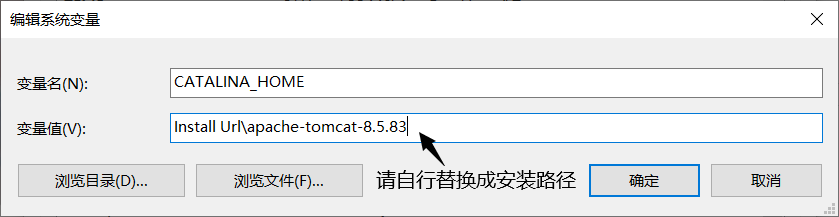
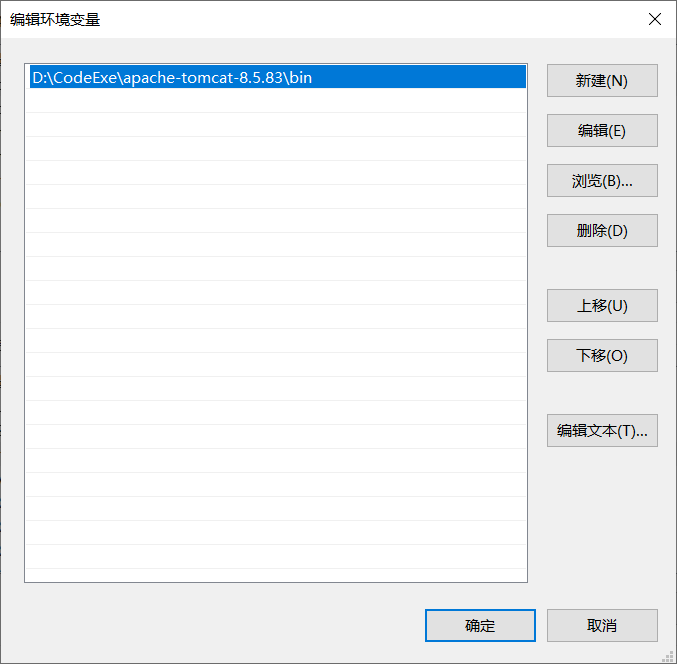

# Java Web 基础

## 1. CS 架构

- CS 架构全称: Client Server, 即为: 客户端 和 服务器 的一种模式, 属于一种比较早期的软件体系结构, 也是实际生活中最常见的一种结构, 如: Tencent QQ, 第五人格, 王者荣耀

- 这种结构将需要处理的业务合理的分配到客户端以及服务端, 客户端通常负责完成与用户的基本交互, 服务端则负责交互后的信息处理

- 优缺点:

  - <div style='color: #67C23A; font-weight: bold'>客户端的 UI界面 和 交互功能 可以更加的丰富</div>

  - <div style='color: #67C23A; font-weight: bold'>因为基本的交互都交给客户端了, 所以服务器主要处理交互后的数据, 减小了服务器的负荷, 从而提高了响应速度</div>

  - <div style="color: #F56C6C; font-weight: bold">适用面并不广泛, 且用户群体大多是固定的</div>

  - <div style='color: #F56C6C; font-weight: bold'>维护和升级的成本较高, 且维护后所有的客户端都必须更新</div>

---

## 2. BS 架构

- BS 架构全称: Browser Server, 即为: 浏览器 和 服务器 的一种模式, 属于近期互联网兴起后的一种软件体系架构, 该架构将系统功能实现的主要业务逻辑集中到服务器, 极少的业务逻辑可以在浏览器实现, 浏览器通常负责完成与用户的交互任务, 而服务器则依旧是负责数据的管理

- 优缺点:

  - <div style='color: #67C23A; font-weight: bold'>无需安装客户端即可使用本服务</div>

  - <div style='color: #67C23A; font-weight: bold'>适用面更加广泛, 用户群体不固定</div>

  - <div style='color: #67C23A; font-weight: bold'>通过权限控制实现多客户访问的目的, 且交互性强</div>

  - <div style='color: #67C23A; font-weight: bold'>后期维护和升级成本低, 无需更新所有的客户版本</div>

  - <div style="color: #F56C6C; font-weight: bold">服务器负荷较重</div>

  - <div style="color: #F56C6C; font-weight: bold">浏览器的界面和功能想要达到客户端的丰富程度需要花费大量的成本,以及浏览器的适配兼容, Css 不同的浏览器的部分属性需要不同的前缀名称, Js 的版本兼容各有不同</div>

---

## 3. Java Web

### 1) Tomcat 服务器

- Tomcat 最初由 Sun 公司的软件架构师 詹姆斯·邓肯·戴维森 开发的, 后来他帮助将其变成开源项目, 并由 sun 公司贡献给 Apache 软件基金会
- Tomcat 服务器是一个开源的轻量级 Web 服务器, 在 中小型系统 和 并发量小 的场合下广泛使用, 是开发、调试 JSP 和 Servlet 的首选

- 下载:

```web
http://tomcat.apache.org/
```

---

### 2) 结构讲解


- bin: 二进制文件 ( 主要关注: <span style='color: #67C23A; font-weight: bold; text-decoration: underline;'>startup.bat 开启</span> 和 <span style="color: #F56C6C; font-weight: bold; text-decoration: underline;">shutdown.bat</span> 关闭 的这两个包 )
- conf: config 配置文件
- lib: 库 和 各种 Jar 包
- log: 日志文件
- temp: 临时文件
- webapps:  Java web 项目存放文件
- work: jsp 文件经过编译处理之后会生成在该文件内

---

### 3）启动 Tomcat

- 方案 01: 点击直接点击安装目录下的 bin 目录下的 startup.bat 文件

- 方案 02: 配置环境变量



- 配置 Path 变量 ( 直至 bin 目录结束: xxx/bin )



- 配置完成后可以在任意地址使用 cmd => startup 即可打开 Tomcat 服务器
- 启动服务器时的乱码可通过 ./conf/logging.properties => @click => oFile.replace('UTF-8', 'GBK')

```properties

java.util.logging.ConsoleHandler.encoding = UTF-8 # 约 47 行

# 修改为 =>
java.util.logging.ConsoleHandler.encoding = GBK # 约 47 行
```

---

### 4) 访问地址

```web
http://127.0.0.1:8080

http://localhost:8080
```

- 修改访问地址: ./conf/server.xml  => @dblclick => oFile.replace(8080, 80);

```xml
<!-- 端口号范围: 0 ~ 65535 -->
<Connector port="8080" protocol="HTTP/1.1"
               connectionTimeout="20000"
               redirectPort="8443" />
```

---

### 5) 配置管理员

- 在 Tomcat 页面会有 Manager App 按钮, 为页面管理按钮, 初次使用需要配置一下 ./conf/tomcat-users.xml => @dblclick => add(\`Data`)

```xml
<!-- 配置管理员账户、密码 -->
<role rolename="manger-gui" />
<user username="admin" password="123456" roles="manager-gui" />
```

---

## 4. 创建项目

- 使用 IDEA 创建一个空项目, 因为模块需要自己后期再做配置


<div style='font-weight: bold;'>※  注意: 需要自定义项目名称, 位置</div>

- 创建完成后, 添加新的模块


- 添加 Java EE 模块, 并修改模板类型: Web 应用, 以及应用程序的服务器改为刚刚安装的: Tomcat 服务器 


- 点击下一步后, 直接确认就可以创建一个 Java Web 程序了


- 然后在确保关闭自启动的 Tomcat 服务器后点击 IDEA 运行, 进行测试, 确认无误后就可以开始书写项目了 ( 测试项目: )

```jsp
<%@ page contentType="text/html; charset=UTF-8" pageEncoding="UTF-8" %>
<!DOCTYPE html>
<html>
<head>
    <title>JSP - Hello World</title>
    <style type="text/css">
        body, div, p, button {
            margin: 0;
            padding: 0;
            user-select: none;
            -webkit-user-select: none;
            -moz-user-select: none;
            -ms-user-select: none;
        }

        #app {
            display: flex;
            justify-content: center;
            align-items: center;
            width: 100vw;
            height: 100vh;
            overflow: hidden;
            background-color: #F2F3F5;
        }

        #app > p#oContent{
            font-size: 12vmin;
        }

        #app > button#oBtn {
            position: fixed;
            bottom: 50px;
            right: 150px;
        }

        .btn-brand{
            min-width: 72px;
            height: 32px;
            color: hsl(0deg, 100%, 100%);
            background-color: #409EFF;
            border: 1px solid #409EFF;
            border-radius: 4px;
            cursor: pointer;
        }

        .btn-brand:hover{
            border-color: #a0cfff;
            background-color: #a0cfff;
        }

        .btn-success{
            min-width: 72px;
            height: 32px;
            color: hsl(0deg, 100%, 100%);
            background-color: #67C23A;
            border: 1px solid #67C23A;
            border-radius: 4px;
            cursor: pointer;
        }

        .btn-success:hover{
            border-color: #b3e19d;
            background-color: #b3e19d;
        }

        .btn-warning {
            min-width: 72px;
            height: 32px;
            color: hsl(0deg, 100%, 100%);
            background-color: #E6A23C;
            border: 1px solid #E6A23C;
            border-radius: 4px;
            cursor: pointer;
        }

        .btn-warning:hover{
            border-color: #f3d19e;
            background-color: #f3d19e;
        }

        .btn-danger{
            min-width: 72px;
            height: 32px;
            color: hsl(0deg, 100%, 100%);
            background-color: #F56C6C;
            border: 1px solid #F56C6C;
            border-radius: 4px;
            cursor: pointer;
        }

        .btn-danger:hover{
            border-color: #fab6b6;
            background-color: #fab6b6;
        }

        .btn-info {
            min-width: 72px;
            height: 32px;
            color: hsl(0deg, 100%, 100%);
            background-color: #909399;
            border: 1px solid #909090;
            border-radius: 4px;
            cursor: pointer;
        }

        .btn-info:hover{
            border-color: #c8c9cc;
            background-color: #c8c9cc;
        }
    </style>
</head>
<body>
    <div id="app">
        <p id="oContent">***** ******</p>
        <button class="btn-brand" id="oBtn">显示</button>
    </div>

    <script type="text/javascript">
        var oBtn = document.querySelector('#oBtn');
        var oContent = document.querySelector('#oContent');
        var IsAppear = true;
        var oCon = ['', ''];
        oBtn.onclick = () => {
            if(IsAppear){
                oCon[0] = oContent.innerText;
                oCon[1] = oBtn.innerText;
                oContent.innerHTML = "Hello World!";
                oBtn.innerText = "隐藏";
            }
            else{
                oContent.innerHTML = oCon[0];
                oBtn.innerText = oCon[1];
            }
            IsAppear = !IsAppear;
        }
    </script>
</body>
</html>
```

---

## 5. 修改的配置


- 在 Java Web 项目中点击上方的配置按钮, 就可以对服务进行基本的配置 ( 如上图所示 )


- 点开后可以对项目的服务器名称进行更改, 在实际开发中为了方便, 且减少错误的概率所以一般服务器名称与启动项目的项目名称相同, 其次可以在配置中修改默认启动的浏览器, 也可以对端口进行更改 ( 端口范围: 0 ~ 65535 )


- 在部署栏中向下滑动, 可以看见一个应用程序上下文的输入框, 将其后缀的沉余直接删除即可, 在 Tomcat 服务下默认会启动当前文件夹目录下 Index.html 其次会启动 Index.jsp 文件, 所以删到只剩余当前文件夹名称即可